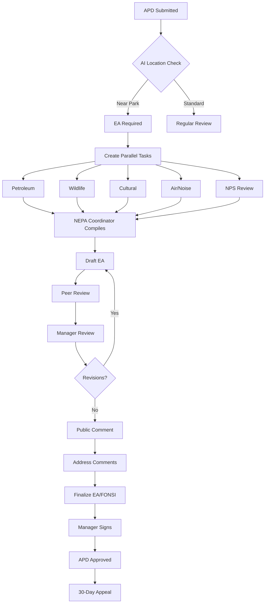

# DOI Drilling Permits (APD) – End‑to‑End Implementation Blueprint

This blueprint details a complete, production‑grade approach for building and demoing the DOI Permits platform on Salesforce (PSS‑aligned), including portal/app pages, workflows, approvals, business rules, notifications, analytics, and a safe payment stub.

Use this with the shipped components in this repo:
- Public portal (LWR) and internal app pages
- Application wizard, document manager, certificate generator, signing
- Multi‑signer support and document preloading

The goal is a working, easy‑to‑demo solution you can extend to full PSS.

---

## 1) System Overview & Architecture

High‑level ecosystem

```
DOI PERMITS PLATFORM
PUBLIC          AGENCY          ADMIN                
     PORTAL          WORKSPACE       CONSOLE              
                
             SALESFORCE PUBLIC SECTOR SOLUTIONS
     Licensing & Permitting   Rules Engine
     Inspection Mgmt          Document Generation
     Case Mgmt                Payment (stub/integration)
     Workflow Orchestration   Portal Experience

                INTEGRATION LAYER
     Einstein AI   Pay.gov (stub)   Login.gov   ESRI GIS
```

Key objects (delivered + extended)
- APD_Application__c: master application, status, SLA, NEPA level
- Well_Information__c: location and well specs
- Document_Package__c + Salesforce Files: document catalog + metadata
- Review_Task__c (sample): orchestrate reviews and SLAs
- Environmental_Assessment__c (sample): EA/FONSI/DR records
- Payment_Record__c: fee logging and stub transactions

Core LWCs in this repo
- nuviPermitApplicationWizard: guided APD capture
- nuviPermitDocumentManager: virtual folders, upload, AI tags
- nuviPermitPrint: generate a certificate PDF with pdf‑lib
- pdfSigner: upload or preload PDF, place signature(s), multi‑signer gating
- nuviPermitSignatureManager: embeds signer and generator for end‑to‑end

PSS mapping (if installed)
- PSS LicenseApplication ↔ APD wizard shell
- PSS FeeManagement ↔ fee calc rules + pay.gov integration point
- PSS DocumentGeneration ↔ nuviPermitPrint/pdfSigner
- PSS WorkflowOrchestration ↔ review task orchestration
- PSS InspectionManagement ↔ field visit scheduling & checklists

---

## 2) Complete Page‑by‑Page Application Flow

Public Portal (LWR)
- Landing: login, apply, status, resources
- Dashboard: quick stats, applications list, actions
- Pre‑check: eligibility, lease/bond checks, surface rights, gating
- APD Wizard: 8 sections (Operator → Location → Plans → SUPO → Env/Cultural → Operators/Insurance → Related → Review)
- Payment: fee review (stub), confirmation
- Confirmation: receipt, next steps, links

Agency Workspace
- Staff Dashboard: workload, queues, SLA alerts
- Intake Review: completeness, validation, NEPA determination
- Assignment: parallel specialist + cooperating agency tasks
- Specialist Review: document viewer, AI extracts, COAs
- EA Drafting: compile from inputs, AI assists, preview
- Public Comment Mgmt: intake, sentiment, response drafting
- Manager Approval: risk summary, decision docs, digital signature

Page inventory (URLs are examples; implement via App Builder/Experience Builder)
- Portal
  - /permits/home, /permits/dashboard, /permits/pre‑check
  - /permits/apd/* (wizard sections), /permits/apd/payment, /permits/apd/confirmation
- Workspace
  - /workspace/dashboard, /workspace/apd/intake‑review, /workspace/apd/assign‑reviews
  - /workspace/apd/technical‑review, /workspace/apd/ea‑draft, /workspace/apd/public‑comments, /workspace/apd/manager‑approval

---

## 3) Detailed Workflow Processes

Primary EA flow with task orchestration (parallel + sequential)



SLAs and dependencies (example)
- Intake: 5 business days → completeness, validation, NEPA determination
- Technical reviews (parallel, 14 days): Petroleum, Wildlife, Cultural, Air/Noise, NPS
- EA preparation: 7 business days (compile, internal review, revise)
- Public comment: 14 days + response synthesis
- Finalization: 5 business days (FONSI/DR + approval)

---

## 4) Approval Matrix & Routing Logic

Routing rules
- Field Office = jurisdiction by geolocation (GIS overlays)
- NEPA Level = EA if near protected areas, multi‑well packages, endangered species; CX if single well on existing pad; EIS if controversial/major impacts
- Specialist assignment = least‑loaded qualified user in office
- Cooperating agencies auto‑added (NPS, BIA, OEPC, SOL) by proximity/subject matter

Approvals
- Specialists submit findings and COAs
- NEPA Coordinator compiles EA → internal review → manager
- Field Office Manager signs FONSI/Decision Record and APD approval
- Operator acknowledgment captured via pdfSigner

---

## 5) PSS Integration Components (Optional)

Leverage PSS where available:
- LicenseApplication: shell for APD wizard steps and draft management
- FeeManagement: fee schedules, fee calc, payment orchestration
- DocumentGeneration: merge‑templates for EA/FONSI/DR/Approval
- WorkflowOrchestration: visual orchestration of parallel tasks and SLAs
- InspectionManagement: onsite inspection scheduling + mobile checklists
- PublicComment: intake, moderation, response sets
- Analytics: prebuilt KPI components

This repo already ships parallel capabilities via custom LWCs and Apex; PSS can be layered on later.

---

## 6) User Interface Specifications

Portal (LWR)
- Pages: Apply, My Documents, Sign
- Components:
  - nuviPermitApplicationWizard: multi‑step; auto‑populate operator info; validations
  - nuviPermitDocumentManager: virtual folders, upload by type, AI tags
  - nuviPermitSignatureManager: wraps pdfSigner; preload or upload; multi‑signer
  - nuviPermitEABuilder: compile EA content, preview PDF, save draft, submit for review
  - nuviPermitPrint: generate and save certificate PDF

Workspace (Internal)
- App Builder pages: Intake Review, Assignment, Technical Review, EA Draft, Public Comments, Manager Approval
- Quick filters, SLA badges, inline actions, COA editors

Accessibility & UX
- WCAG AA contrast; 44px touch targets; keyboard focus styles
- Large PDFs: Fit‑to‑width preview; jump to signature hotspots

---

## 7) Business Rules Engine (Examples)

NEPA determination (simplified)
```js
const determineNEPA = (ctx) => {
  if (ctx.nearNationalPark && ctx.distanceMi < 5) return { level: 'EA', reason: 'Within 5 miles of National Park' };
  if (ctx.nearTribal && ctx.distanceMi < 2) return { level: 'EA', reason: 'Within 2 miles of Tribal lands' };
  if (ctx.wellCount > 5) return { level: 'EA', reason: 'Multiple well development' };
  if (ctx.endangeredSpecies) return { level: 'EA', reason: 'Endangered species present' };
  if (ctx.existingPad && ctx.wellCount === 1) return { level: 'CX', reason: 'Single well on existing pad' };
  if (ctx.controversial) return { level: 'EIS', reason: 'Controversial project' };
  return { level: 'EA', reason: 'Default assessment required' };
};
```

Specialist assignment (Apex pseudo)
```apex
SELECT UserId, COUNT(Id) cnt
FROM Review_Task__c
WHERE Specialist_Role__c = :role AND Field_Office__c = :office AND Status__c != 'Complete'
GROUP BY UserId ORDER BY cnt ASC LIMIT 1;
```

SLA derivation
```apex
Integer base = new Map<String,Integer>{'Intake'=>5,'Technical Review'=>14,'EA'=>7,'Manager Review'=>3}.get(taskType);
Decimal mult = new Map<String,Decimal>{'High'=>0.5,'Medium'=>1,'Low'=>1.5}.get(priority);
Integer slaDays = Math.ceil(base * mult);
```

---

## 8) Notification & Communication Framework

Events and messages (examples)
- APD_SUBMITTED → Operator + Field Office Lead
- REVIEW_COMPLETE (per specialist) → NEPA Coordinator
- PUBLIC_COMMENT_OPEN → Operator + subscribers
- APPROVAL_ISSUED → Operator + reviewers
- SLA_WARNING → Assignee + Supervisor

Delivery
- Email alerts via Flows
- In‑app toasts + task feed posts
- Experience Cloud notifications (login.gov users)

---

## 9) Reporting & Analytics Requirements

KPIs
- Avg Time to Decision (TTD)
- Approval rate by office
- Review SLA compliance
- Bottlenecks by task type

Dashboards
- Executive: TTD, approval rate, in‑progress, bottlenecks, office comparison
- Operations: SLA aging, overdue tasks, comment sentiment

---

## 10) Payments – Safe Demo Stub (Pay.gov‑like)

What’s shipped
- Apex: `PayGovService` and `Nuvi_Permit_PayGovService` provide a stubbed `createPaymentIntent(amount,'USD',applicationId)` returning a predictable, non‑charging result.
- Object: `Payment_Record__c` for logging.

How to demo
- Add a Quick Action on APD_Application__c calling `Nuvi_Permit_PayGovService.createPaymentIntent` and write a `Payment_Record__c` with the response (status `NOT_CONFIGURED` is OK for demo) and a fake reference `PAY‑YYYY‑NNNN`.
- Or build a simple LWC “Permit Payment” page (card form) that calls the same Apex and displays the reference.

Future integration
- Create a Named Credential to Pay.gov
- Swap stub call for real HTTP callout (code scaffold already commented in `PayGovService.cls`).

---

## 11) Digital Signatures & Certificates

Components
- `nuviPermitPrint`: creates certificate PDFs via pdf‑lib; saves to record and emits an event
- `pdfSigner`: now supports both upload and preload; multi‑signer gating; `signingcomplete` event
- `nuviPermitSignatureManager`: wires generator → signer for a seamless flow

Multi‑signer pattern
- Configure `required-signatures` per step (e.g., 1 for manager, 1 for operator)
- On `signingcomplete`, route to next signer and preload the saved ContentVersion (no re‑upload)

---

## 12) Implementation Roadmap (Phased)

Phase 1 – Foundation (Weeks 1–6)
- Org setup, security, user provisioning
- Data model and list views
- LWR portal and internal app pages
- APD wizard sections, document manager

Phase 2 – Core (Weeks 7–14)
- AI extraction stubs + validations
- Fee calc rules + payment stub
- Parallel review tasks + SLAs
- Notifications framework

Phase 3 – Advanced (Weeks 15–22)
- EA builder + public comments
- Multi‑agency coordination
- Reporting & dashboards

Phase 4 – Integration & Optimization (Weeks 23–26)
- GIS overlays + field office assignment
- Performance tuning, caching, bulk ops
- Training and UAT

Phase 5 – Post‑Launch
- Monitoring, enhancements, mobile inspections

---

## 13) Security & Compliance

Access model (example)
- Operator: CRUD own APDs and drafts; Files they upload
- BLM Specialist: read all, update assigned reviews; limited financial data
- NEPA Coordinator: all EA docs; compile + route
- Field Manager: decision docs + final approval
- Admin: full access
- Public Viewer: read approved public documents only

Field‑level security
- SSN/EIN encrypted (Shield recommended); internal only
- Financial fields restricted; audit trail enabled
- Internal comments hidden from portal profiles

Compliance
- Signed PDFs stored as Salesforce Files; event logs for signature actions
- 30‑day appeal windows tracked; public access as policy dictates

---

## 14) Build Checklist (Demo‑Ready)

- LWR site with Apply / My Documents / Sign pages published
- Internal “Permit Operations” App Page activated
- Sample APD created; at least one uploaded document
- Certificate generated with `nuviPermitPrint`; signer opens automatically
- Payment Quick Action configured (stub) and produces a reference
- Dashboard with 2–3 KPIs (TTD, approvals, SLA aging) for screenshots/demo

That’s it. Use `START_HERE.md` for the fast build steps, then this blueprint to scale into PSS patterns and agency integrations.
