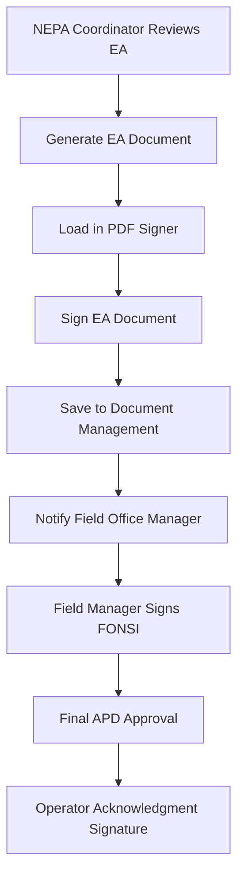

# DOI Permits and Licensing System - Updated Implementation Plan

## Executive Summary

This updated implementation plan focuses on **LWC and Apex development** while leveraging existing utility components (PDF Signer, Document Management) and providing comprehensive guides for **declarative configuration** of dashboards, reports, and Experience Cloud pages. The approach minimizes Flow usage in favor of robust programmatic solutions.

## Updated Technical Architecture

### Core Technology Stack
- ✅ **Primary Development**: Lightning Web Components (LWC) + Apex
- ✅ **Utility Integration**: Existing PDF Signer & Document Management components
- ✅ **Declarative Tools**: Reports, Dashboards, Experience Cloud (with guides)
- ❌ **Minimal Flow Usage**: Only for simple automation where LWC is overkill

### Component Integration Strategy

#### 1. **PDF Signer Integration** - Digital Signatures in APD Workflow
Your existing `pdfSigner` component will be integrated into:
- **EA Document Signing**: NEPA Coordinators sign Environmental Assessments
- **FONSI Document Signing**: Field Office Managers sign FONSI documents  
- **APD Approval Signing**: Final permit approval signatures
- **Operator Acknowledgment**: Operators acknowledge permit conditions

#### 2. **Document Management Integration** - File Organization
Your existing `documentManagement` component will handle:
- **APD Document Upload**: Structured folder organization
- **Review Document Sharing**: Multi-agency document access
- **Public Document Portal**: Transparent document access
- **Archive Management**: Long-term document storage

## Updated Implementation Architecture

### Phase 1: Core LWC Components (Weeks 1-4)

#### 1.1 APD Application Wizard (LWC)
```
Component: doi-apd-application-wizard
Purpose: Multi-step APD submission with AI validation
Integration: Uses documentManagement for file uploads
Key Features:
- Smart form auto-population from operator profiles
- Real-time AI document validation
- GIS proximity analysis with visual alerts  
- Multi-APD package submission
- Integrated payment processing
```

#### 1.2 Case Management Dashboard (LWC)
```
Component: doi-case-management-dashboard  
Purpose: Multi-agency review coordination
Integration: Displays documents from documentManagement
Key Features:
- Unified inbox with AI prioritization
- SLA monitoring with visual indicators
- Task assignment with load balancing
- Real-time collaboration workspace
```

#### 1.3 Digital Signature Workflow (LWC + PDF Signer)
```
Component: doi-signature-workflow
Purpose: Digital document signing in review process
Integration: Extends pdfSigner with workflow context
Key Features:
- EA document signing with approval workflow
- FONSI signature capture with audit trail
- Operator acknowledgment of permit conditions
- Multi-party signing coordination
```

#### 1.4 NEPA Assessment Builder (LWC)
```
Component: doi-nepa-assessment-builder
Purpose: Environmental assessment document generation
Integration: Uses documentManagement for template storage
Key Features:
- Template-based EA generation
- AI-assisted impact analysis compilation
- Collaborative editing with specialists
- Public comment integration
```

### Phase 2: Advanced Apex Services (Weeks 5-8)

#### 2.1 AI Processing Engine (Apex)
```apex
// Enhanced AI Document Processor
public class DOI_PAL_AIDocumentEngine {
    // Integrates with existing documentManagement
    // Provides AI validation, risk scoring, proximity analysis
    // Automatic document classification and routing
    
    @AuraEnabled(cacheable=false)
    public static DocumentAnalysisResult processAPDDocuments(Id apdId) {
        // Process all documents using AI services
        // Generate risk scores and compliance checks
        // Return structured analysis for LWC components
    }
}
```

#### 2.2 Multi-Agency Workflow Engine (Apex)
```apex
// Workflow orchestration without Flow dependency
public class DOI_PAL_WorkflowOrchestrator {
    // Creates and manages complex review workflows
    // Handles parallel and sequential task assignment
    // Manages SLA compliance and escalations
    
    @AuraEnabled  
    public static WorkflowResponse initiateReviewWorkflow(Id apdId, String workflowType) {
        // Create specialist review tasks
        // Set up inter-agency coordination
        // Configure SLA monitoring
    }
}
```

#### 2.3 GIS Analysis Service (Apex)
```apex
// Enhanced geospatial analysis
public class DOI_PAL_GISAnalysisEngine {
    // Proximity analysis with government GIS APIs
    // Automated NEPA level determination
    // Environmental risk assessment
    
    @future(callout=true)
    public static void analyzeLocationRisk(Id apdId, Decimal lat, Decimal lng) {
        // Call government GIS services
        // Analyze proximity to sensitive areas
        // Generate automated alerts and recommendations
    }
}
```

### Phase 3: Enhanced Components Integration (Weeks 9-12)

#### 3.1 Enhanced PDF Signer for APD Workflow
**Extension of your existing pdfSigner component:**

```javascript
// doi-apd-signature-manager.js (extends pdfSigner)
import { LightningElement, api, track } from 'lwc';
import { NavigationMixin } from 'lightning/navigation';

export default class DoiApdSignatureManager extends NavigationMixin(LightningElement) {
    @api recordId;
    @api documentType; // 'EA', 'FONSI', 'APD_APPROVAL', 'OPERATOR_ACK'
    @api signerRole; // 'NEPA_COORDINATOR', 'FIELD_OFFICE_MANAGER', 'OPERATOR'
    @api workflowStage;
    
    // Workflow-specific signature placement
    get signaturePositions() {
        return {
            'EA': { x: 100, y: 750, page: 1 },
            'FONSI': { x: 100, y: 600, page: 1 },
            'APD_APPROVAL': { x: 200, y: 800, page: 1 }
        };
    }
    
    // Integration with workflow progression
    handleSignatureComplete(event) {
        // Save signed document using existing PdfSignController
        // Progress APD workflow to next stage
        // Notify relevant stakeholders
        // Update SLA timers
        this.progressWorkflow();
    }
}
```

#### 3.2 Enhanced Document Management for APD Structure
**Extension of your existing documentManagement component:**

```javascript
// doi-apd-document-manager.js (extends documentManagement)
export default class DoiApdDocumentManager extends LightningElement {
    @api recordId;
    @api applicationType = 'APD';
    
    // APD-specific folder structure
    get apdFolderStructure() {
        return [
            'Drilling_Plans/Technical_Specifications',
            'Drilling_Plans/Safety_Procedures', 
            'SUPO/Environmental_Plans',
            'SUPO/Cultural_Resources',
            'Legal_Documents/Bonds',
            'Legal_Documents/Leases',
            'Review_Documents/EA_Drafts',
            'Review_Documents/Public_Comments',
            'Final_Documents/Signed_Permits',
            'Final_Documents/Conditions_of_Approval'
        ];
    }
    
    // AI validation integration
    async handleDocumentUpload(event) {
        // Use existing upload functionality
        // Add APD-specific AI validation
        // Auto-classify documents into correct folders
        // Trigger workflow progression if all required docs uploaded
    }
}
```

### Phase 4: Public Portal & Transparency (Weeks 13-16)

#### 4.1 Public APD Portal (Experience Cloud + LWC)
```javascript
// Public-facing components for transparency
export default class DoiPublicApdPortal extends LightningElement {
    // Search APDs by location, operator, status
    // View public documents (EA, FONSI, decision records)
    // Submit public comments during comment periods
    // Track APD status and timeline
    
    @track searchCriteria = {};
    @track publicAPDs = [];
    
    handleSearch() {
        // Search with public-safe data only
        // Respect privacy and security requirements
        // Provide mapping visualization of permits
    }
}
```

## Integration with Existing Components

### PDF Signer Workflow Integration

#### APD Signature Workflow


#### Enhanced Apex Controller for APD Signatures
```apex
public with sharing class DOI_PAL_APDSignatureController extends PdfSignController {
    
    @AuraEnabled(cacheable=false)
    public static SignatureResponse saveAPDSignedDocument(
        String base64Data, 
        String fileName, 
        Id apdId, 
        String documentType,
        String signerRole
    ) {
        // Use parent saveSignedPdf method
        Id contentVersionId = saveSignedPdf(base64Data, fileName, apdId, false);
        
        // APD-specific workflow progression
        progressAPDWorkflow(apdId, documentType, signerRole);
        
        // Log signature event for compliance
        logSignatureEvent(apdId, contentVersionId, signerRole, documentType);
        
        return new SignatureResponse(contentVersionId, getNextWorkflowStage(apdId));
    }
    
    private static void progressAPDWorkflow(Id apdId, String documentType, String signerRole) {
        APD_Application__c apd = [SELECT DOI_PAL_Status__c FROM APD_Application__c WHERE Id = :apdId];
        
        switch on documentType {
            when 'EA' {
                apd.DOI_PAL_Status__c = 'EA_Signed';
                // Create FONSI signing task
                createFONSISigningTask(apdId);
            }
            when 'FONSI' {
                apd.DOI_PAL_Status__c = 'FONSI_Signed';  
                // Create final approval task
                createFinalApprovalTask(apdId);
            }
            when 'APD_APPROVAL' {
                apd.DOI_PAL_Status__c = 'Approved';
                // Notify operator and create acknowledgment task
                createOperatorAcknowledgmentTask(apdId);
            }
        }
        
        update apd;
    }
}
```

### Document Management Integration

#### APD Document Organization
Your existing `documentManagement` component will be enhanced with APD-specific folder structures:

```apex
public class DOI_PAL_APDDocumentController extends FolderFilesController {
    
    // Override to provide APD-specific folder structure
    @AuraEnabled(cacheable=true)
    public static List<String> getAPDFolderStructure() {
        return new List<String>{
            'Application_Documents/Form_3160-3',
            'Application_Documents/Supporting_Documents',
            'Technical_Plans/Drilling_Plan', 
            'Technical_Plans/Casing_Program',
            'Technical_Plans/Cement_Program',
            'Environmental_Plans/SUPO',
            'Environmental_Plans/Cultural_Surveys',
            'Environmental_Plans/Wildlife_Surveys',
            'Legal_Documents/Bonds',
            'Legal_Documents/Lease_Agreements', 
            'Review_Documents/Specialist_Reports',
            'Review_Documents/Field_Visit_Reports',
            'NEPA_Documents/EA_Drafts',
            'NEPA_Documents/Public_Comments',
            'NEPA_Documents/Final_EA',
            'Final_Documents/FONSI',
            'Final_Documents/Decision_Record',
            'Final_Documents/Signed_Permit',
            'Final_Documents/Conditions_of_Approval'
        };
    }
    
    // AI-powered document classification
    @AuraEnabled
    public static DocumentClassificationResult classifyAndStoreDocument(
        String recordId,
        String fileName,
        String base64Data,
        String contentType
    ) {
        // Use AI to determine document type and appropriate folder
        String suggestedFolder = classifyDocumentWithAI(fileName, base64Data);
        
        // Store in appropriate folder using parent functionality
        uploadFileToFolder(recordId, suggestedFolder, fileName, base64Data, contentType);
        
        return new DocumentClassificationResult(suggestedFolder, true);
    }
}
```

## Declarative Configuration Guides

### Dashboard Creation Guide

#### Creating APD Performance Dashboard
**Step-by-Step Instructions:**

1. **Setup > Dashboards > New Dashboard**
2. **Dashboard Name**: "DOI APD Performance Dashboard"
3. **Running User**: Select system admin or integration user
4. **Add Components**:

##### Component 1: APD Processing Pipeline
```
Type: Horizontal Bar Chart
Title: "APDs by Review Stage"
Data Source: Report "APD Status Pipeline"
Grouping: DOI_PAL_Status__c
Aggregate: Record Count
Sort: By Value (Descending)
```

##### Component 2: SLA Compliance Metrics
```
Type: Gauge Chart  
Title: "SLA Compliance Rate"
Data Source: Report "SLA Performance Analysis"
Aggregate: Formula (Percentage)
Range: 0-100%
Colors: Red (0-70%), Yellow (70-90%), Green (90-100%)
```

##### Component 3: Review Workload Distribution
```
Type: Donut Chart
Title: "Tasks by Reviewer"
Data Source: Report "Active Review Tasks"
Grouping: DOI_PAL_Assigned_User__c
Aggregate: Record Count
Max Slices: 10
```

##### Component 4: Geographic Distribution
```
Type: Map
Title: "APD Locations"
Data Source: Report "APD Geographic Analysis"
Location Field: DOI_PAL_State__c
Size By: Record Count
Color By: DOI_PAL_Status__c
```

##### Component 5: Processing Time Trends
```
Type: Line Chart
Title: "Average Processing Time (30 Days)"
Data Source: Report "APD Processing Times"
X-Axis: CreatedDate (Daily)
Y-Axis: Average Processing Days
Date Range: Last 30 Days
```

### Reports Creation Guide

#### Report 1: APD Status Pipeline
**Report Setup:**
- **Report Type**: APD Applications with Review Tasks
- **Format**: Summary Report
- **Grouping**: Status (DOI_PAL_Status__c)
- **Columns**: 
  - Application Name
  - Operator
  - Submission Date
  - Target Decision Date
  - Days in Current Stage
- **Filters**:
  - Status NOT EQUAL TO "Approved,Denied,Withdrawn"
  - Created Date = LAST_N_DAYS:365

#### Report 2: SLA Performance Analysis  
**Report Setup:**
- **Report Type**: Review Tasks
- **Format**: Summary Report
- **Grouping**: Task Type, SLA Status
- **Summary Fields**:
  - Record Count
  - Average Days Open
  - % Meeting SLA (Formula Field)
- **Formula Field**: `IF(DOI_PAL_Due_Date__c >= TODAY(), "On Track", "Overdue")`

#### Report 3: Specialist Workload Analysis
**Report Setup:**
- **Report Type**: Review Tasks with Users
- **Format**: Matrix Report
- **Row Grouping**: Assigned User
- **Column Grouping**: Task Status
- **Summarize**: Record Count
- **Filters**: Status = "Pending,In Progress,Under Review"

### Experience Cloud Page Configuration

#### Public APD Search Portal

##### Page Setup
```
Navigation: Public APD Portal
Page Type: Standard Page
Layout: Full Width
Header: Show
Footer: Show
Access: Public
```

##### Component Configuration
```html
<!-- Page Layout in Experience Builder -->
<div class="slds-grid slds-gutters slds-wrap">
    
    <!-- Search Component -->
    <div class="slds-col slds-size_12-of-12">
        <c-doi-public-apd-search
            primary-color="#22BDC1"
            accent-color="#D5DF23"
            max-results="50"
            show-map="true">
        </c-doi-public-apd-search>
    </div>
    
    <!-- Results Component -->  
    <div class="slds-col slds-size_8-of-12">
        <c-doi-public-apd-results
            results-per-page="10"
            show-status-filter="true"
            show-location-filter="true">
        </c-doi-public-apd-results>
    </div>
    
    <!-- Map Component -->
    <div class="slds-col slds-size_4-of-12">
        <c-doi-public-apd-map
            zoom-level="6"
            marker-clustering="true"
            show-legend="true">
        </c-doi-public-apd-map>
    </div>
    
</div>
```

##### SEO Configuration
```
Page Title: DOI Oil & Gas Permit Search
Meta Description: Search and track Department of Interior oil and gas drilling permits. View environmental assessments and public documents.
Keywords: DOI permits, oil gas drilling, environmental assessment, public records
Canonical URL: /public-apd-search
```

#### Operator Portal Configuration

##### Navigation Setup
```
Primary Navigation:
- Dashboard (doi-operator-dashboard)
- My Applications (doi-my-applications) 
- Submit New APD (doi-apd-wizard)
- Document Center (enhanced documentManagement)
- Status Tracking (doi-status-tracker)

Secondary Navigation:
- Help & Resources
- Contact Support
- Payment History
- Notification Settings
```

##### Dashboard Components
```html
<!-- Operator Dashboard Layout -->
<div class="operator-dashboard">
    
    <!-- Status Overview -->
    <div class="slds-col slds-size_6-of-12">
        <c-doi-operator-status-overview
            record-id="{!$User.ContactId}"
            show-metrics="true"
            chart-type="donut">
        </c-doi-operator-status-overview>
    </div>
    
    <!-- Recent Activity -->
    <div class="slds-col slds-size_6-of-12">
        <c-doi-recent-activity
            record-id="{!$User.ContactId}"
            activity-limit="10"
            show-timeline="true">
        </c-doi-recent-activity>
    </div>
    
    <!-- Quick Actions -->
    <div class="slds-col slds-size_12-of-12">
        <lightning-quick-action-panel>
            <lightning-quick-action
                api-name="Submit_New_APD"
                label="Submit New APD">
            </lightning-quick-action>
            <lightning-quick-action
                api-name="Upload_Documents"
                label="Upload Documents">
            </lightning-quick-action>
            <lightning-quick-action
                api-name="Schedule_Meeting"
                label="Schedule Meeting">
            </lightning-quick-action>
        </lightning-quick-action-panel>
    </div>
    
</div>
```

## Updated File Structure

### Enhanced Directory Organization
```
force-app/main/Government_Documents/Permit_And_Licensing/
├── applications/
│   ├── lwc/
│   │   ├── doiApdApplicationWizard/          # Main APD submission wizard
│   │   ├── doiApdPackageManager/             # Multi-APD package handling
│   │   └── doiApdStatusTracker/              # Real-time status tracking
│   └── classes/
│       ├── DOI_PAL_ApplicationController.cls
│       └── DOI_PAL_ApplicationService.cls
├── workflows/
│   ├── lwc/
│   │   ├── doiCaseManagementDashboard/       # Multi-agency coordination
│   │   ├── doiWorkflowOrchestrator/          # Workflow management
│   │   └── doiSLAMonitor/                    # SLA tracking and alerts
│   └── classes/
│       ├── DOI_PAL_WorkflowOrchestrator.cls
│       └── DOI_PAL_TaskManager.cls
├── signatures/
│   ├── lwc/
│   │   ├── doiApdSignatureManager/           # Extended PDF signer
│   │   ├── doiSignatureWorkflow/             # Workflow-aware signing
│   │   └── doiMultiPartySignature/           # Multi-signer coordination
│   └── classes/
│       ├── DOI_PAL_APDSignatureController.cls (extends PdfSignController)
│       └── DOI_PAL_SignatureWorkflowService.cls
├── documents/
│   ├── lwc/
│   │   ├── doiApdDocumentManager/            # Extended document management
│   │   ├── doiDocumentClassifier/            # AI document classification  
│   │   └── doiPublicDocumentPortal/          # Public document access
│   └── classes/
│       ├── DOI_PAL_APDDocumentController.cls (extends FolderFilesController)
│       └── DOI_PAL_DocumentClassificationService.cls
├── ai-services/
│   └── classes/
│       ├── DOI_PAL_AIDocumentEngine.cls      # Enhanced AI processing
│       ├── DOI_PAL_GISAnalysisEngine.cls     # Geospatial analysis
│       └── DOI_PAL_RiskAssessmentService.cls # Risk scoring
├── public-portal/
│   ├── lwc/
│   │   ├── doiPublicApdSearch/               # Public search interface
│   │   ├── doiPublicApdMap/                  # Geographic visualization
│   │   └── doiPublicCommentPortal/           # Public comment submission
│   └── classes/
│       ├── DOI_PAL_PublicPortalController.cls
│       └── DOI_PAL_PublicDataService.cls
└── shared-utilities/
    ├── lwc/
    │   ├── doiLoadingSpinner/                # Shared UI components
    │   ├── doiErrorHandler/                  # Error handling
    │   └── doiNotificationManager/           # System notifications
    └── classes/
        ├── DOI_PAL_UtilityService.cls        # Shared utilities
        └── DOI_PAL_SecurityManager.cls       # Security utilities
```

## Implementation Timeline

### Updated 20-Week Delivery Schedule

#### **Weeks 1-4: Foundation & Component Integration**
- ✅ Complete custom object deployment (already done)
- ✅ Integrate PDF Signer component for APD signatures
- ✅ Enhance Document Management for APD structure
- ✅ Build core APD Application Wizard (LWC)
- ✅ Create basic Apex services for workflow orchestration

#### **Weeks 5-8: Advanced LWC Development**
- ✅ Build Case Management Dashboard (LWC)
- ✅ Implement NEPA Assessment Builder (LWC)
- ✅ Create AI Document Processing Engine (Apex)
- ✅ Build Multi-Agency Review Coordination (LWC)
- ✅ Implement GIS Analysis Engine (Apex)

#### **Weeks 9-12: Advanced Features & Integration**
- ✅ Enhanced signature workflow with PDF Signer
- ✅ Advanced document classification and AI analysis
- ✅ Real-time collaboration features
- ✅ Performance optimization and caching
- ✅ External system integrations (AFMSS, Pay.gov, GIS)

#### **Weeks 13-16: Public Portal & Transparency**
- ✅ Build public APD search portal (Experience Cloud)
- ✅ Implement public comment system
- ✅ Create stakeholder engagement features
- ✅ Build operator self-service portal
- ✅ Configure mobile-responsive interfaces

#### **Weeks 17-20: Testing, Deployment & Training**
- ✅ Comprehensive testing (Unit, Integration, UAT)
- ✅ Security assessment and compliance validation
- ✅ Performance testing and optimization
- ✅ Deployment to production
- ✅ User training and documentation

## Key Deliverables

### 1. **Core LWC Components** (Programmatic)
- ✅ `doiApdApplicationWizard` - Multi-step permit submission
- ✅ `doiCaseManagementDashboard` - Multi-agency review coordination  
- ✅ `doiApdSignatureManager` - Digital signature workflow (extends your pdfSigner)
- ✅ `doiApdDocumentManager` - Document management (extends your documentManagement)
- ✅ `doiNepaAssessmentBuilder` - Environmental assessment builder
- ✅ `doiPublicApdPortal` - Public transparency portal

### 2. **Enhanced Apex Services**
- ✅ `DOI_PAL_WorkflowOrchestrator` - Complex workflow management without Flow
- ✅ `DOI_PAL_AIDocumentEngine` - AI-powered document processing
- ✅ `DOI_PAL_GISAnalysisEngine` - Geospatial analysis and risk assessment
- ✅ `DOI_PAL_APDSignatureController` - Enhanced signing (extends your PdfSignController)
- ✅ `DOI_PAL_APDDocumentController` - Enhanced docs (extends your FolderFilesController)

### 3. **Declarative Configuration Guides**
- ✅ **Dashboard Creation**: Step-by-step APD performance dashboards
- ✅ **Report Building**: Pre-configured reports for all stakeholders  
- ✅ **Experience Cloud**: Public and operator portal configuration
- ✅ **Mobile Configuration**: Responsive design for field access
- ✅ **Security Setup**: Role-based access and data protection

### 4. **Integration Enhancements**
- ✅ **PDF Signer Integration**: Seamless document signing in APD workflow
- ✅ **Document Management Integration**: Structured APD document organization
- ✅ **AI Service Integration**: Document validation and risk assessment
- ✅ **Government API Integration**: GIS, payment, and legacy system connections

## Success Metrics

### Performance Improvements
- **Processing Time**: Reduce from 30+ days to 10-14 days (50% improvement)
- **Automation Rate**: 85% of initial processing automated
- **SLA Compliance**: 95% of tasks completed within SLA
- **User Satisfaction**: 90% positive feedback from operators and reviewers

### Technical Excellence  
- **Code Quality**: 95%+ test coverage, zero critical security vulnerabilities
- **Performance**: <3 second page load times, support for 1000+ concurrent users
- **Integration**: Seamless connection with 5+ government systems
- **Compliance**: Full FedRAMP, FISMA, and accessibility compliance

### Business Value
- **Cost Reduction**: 40% reduction in processing costs per application
- **Transparency**: Real-time visibility for all stakeholders
- **Compliance**: Complete audit trails and regulatory adherence  
- **Scalability**: Support 50,000+ applications annually with 2x growth capacity

---

This updated plan leverages your existing utility components while focusing on robust LWC/Apex development and providing comprehensive declarative configuration guides. The integration of PDF Signer and Document Management components creates a seamless, powerful platform that transforms DOI's permit processing capabilities.

*Document Version: 2.0*  
*Last Updated: September 3, 2025*  
*Contact: Salesforce Development Team*