# DOI Permits - PDF Signer Integration Guide

## Overview

This guide details how your existing **PDF Signer** component integrates seamlessly into the DOI APD workflow, enabling digital signatures at critical approval stages while maintaining full audit compliance and workflow automation.

## PDF Signer Integration Architecture

### Signature Points in APD Workflow

```mermaid
graph TD
    A[APD Submitted] --> B[Initial Review]
    B --> C[Specialist Reviews Complete]
    C --> D[EA Document Generated]
    D --> E["🖊️ NEPA Coordinator Signs EA"]
    E --> F[EA Posted for Public Comment]
    F --> G[Comments Processed]
    G --> H["🖊️ Field Office Manager Signs FONSI"]
    H --> I[Decision Record Generated]
    I --> J["🖊️ Field Manager Signs APD Approval"]
    J --> K["🖊️ Operator Signs Acknowledgment"]
    K --> L[Permit Issued]
    
    style E fill:#22BDC1,stroke:#fff,color:#fff
    style H fill:#22BDC1,stroke:#fff,color:#fff  
    style J fill:#22BDC1,stroke:#fff,color:#fff
    style K fill:#D5DF23,stroke:#000,color:#000
```



### Integration Points

#### 1. **EA Document Signing** - NEPA Coordinator
**Trigger**: EA draft completed by specialists
**Document**: Environmental Assessment PDF
**Signer**: NEPA Coordinator
**Location**: Page 1, signature block (pre-defined position)
**Next Step**: Public comment period begins

#### 2. **FONSI Document Signing** - Field Office Manager  
**Trigger**: Public comment period closed, final EA approved
**Document**: Finding of No Significant Impact PDF
**Signer**: Field Office Manager
**Location**: Page 1, bottom signature block
**Next Step**: Decision record generation

#### 3. **APD Approval Signing** - Field Office Manager
**Trigger**: FONSI signed, decision record completed
**Document**: Final APD Approval with Conditions
**Signer**: Field Office Manager  
**Location**: Multiple pages (approval page + conditions pages)
**Next Step**: Operator notification

#### 4. **Operator Acknowledgment** - Operator Representative
**Trigger**: APD approved and conditions attached
**Document**: Conditions of Approval acknowledgment
**Signer**: Authorized operator representative
**Location**: Final page acknowledgment section
**Next Step**: Permit becomes active

## Enhanced LWC Components

### 1. DOI APD Signature Manager (Extends your pdfSigner)

```javascript
// doiApdSignatureManager.js
import { LightningElement, api, track, wire } from 'lwc';
import { ShowToastEvent } from 'lightning/platformShowToastEvent';
import { getRecord } from 'lightning/uiRecordApi';

// Import your existing PDF Sign Controller
import saveSignedPdf from '@salesforce/apex/PdfSignController.saveSignedPdf';

// Import new APD-specific controller
import saveAPDSignedDocument from '@salesforce/apex/DOI_PAL_APDSignatureController.saveAPDSignedDocument';
import getSigningContext from '@salesforce/apex/DOI_PAL_APDSignatureController.getSigningContext';
import validateSignerAuthorization from '@salesforce/apex/DOI_PAL_APDSignatureController.validateSignerAuthorization';

export default class DoiApdSignatureManager extends LightningElement {
    // API properties for workflow integration
    @api recordId;              // APD Application ID
    @api documentType;          // 'EA', 'FONSI', 'APD_APPROVAL', 'OPERATOR_ACK'
    @api signerRole;            // 'NEPA_COORDINATOR', 'FIELD_OFFICE_MANAGER', 'OPERATOR'
    @api workflowStage;         // Current workflow stage
    @api documentId;            // Content Document ID to sign
    @api requiredSignatures;    // Number of required signatures
    @api primaryColor = '#22BDC1';
    @api accentColor = '#D5DF23';
    
    // Component state
    @track isLoading = false;
    @track signingContext = {};
    @track signaturePositions = [];
    @track currentSignatureIndex = 0;
    @track isAuthorizedSigner = false;
    @track documentPreviewUrl = '';
    
    // Wire APD record data for context
    @wire(getRecord, { 
        recordId: '$recordId', 
        fields: ['APD_Application__c.Name', 'APD_Application__c.DOI_PAL_Status__c', 
                'APD_Application__c.DOI_PAL_Operator__r.Name'] 
    })
    apdRecord;
    
    connectedCallback() {
        this.initializeSigningSession();
    }
    
    async initializeSigningSession() {
        this.isLoading = true;
        
        try {
            // Get signing context from server
            this.signingContext = await getSigningContext({
                apdId: this.recordId,
                documentType: this.documentType,
                signerRole: this.signerRole
            });
            
            // Validate current user is authorized to sign
            this.isAuthorizedSigner = await validateSignerAuthorization({
                apdId: this.recordId,
                documentType: this.documentType,
                signerRole: this.signerRole
            });
            
            if (!this.isAuthorizedSigner) {
                this.showToast('Error', 'You are not authorized to sign this document', 'error');
                return;
            }
            
            // Set up signature positions based on document type
            this.configureSignaturePositions();
            
            // Load document for preview
            await this.loadDocumentPreview();
            
        } catch (error) {
            this.showToast('Error', 'Failed to initialize signing session: ' + error.body?.message, 'error');
        } finally {
            this.isLoading = false;
        }
    }
    
    configureSignaturePositions() {
        // Pre-defined signature positions for different document types
        const positions = {
            'EA': [
                { page: 1, x: 100, y: 750, width: 200, height: 60, label: 'NEPA Coordinator Signature' }
            ],
            'FONSI': [
                { page: 1, x: 100, y: 650, width: 200, height: 60, label: 'Field Office Manager Signature' },
                { page: 1, x: 350, y: 650, width: 100, height: 30, label: 'Date' }
            ],
            'APD_APPROVAL': [
                { page: 1, x: 100, y: 800, width: 200, height: 60, label: 'Approving Official Signature' },
                { page: 1, x: 350, y: 800, width: 100, height: 30, label: 'Date' },
                // Additional signatures on conditions pages if needed
                ...(this.signingContext.hasConditions ? [
                    { page: -1, x: 100, y: 100, width: 200, height: 60, label: 'Manager Initials (All Pages)' }
                ] : [])
            ],
            'OPERATOR_ACK': [
                { page: -1, x: 100, y: 200, width: 200, height: 60, label: 'Operator Representative' },
                { page: -1, x: 350, y: 200, width: 150, height: 30, label: 'Title' },
                { page: -1, x: 350, y: 160, width: 100, height: 30, label: 'Date' }
            ]
        };
        
        this.signaturePositions = positions[this.documentType] || [];
    }
    
    async loadDocumentPreview() {
        if (this.documentId) {
            // Generate preview URL for the document
            this.documentPreviewUrl = `/sfc/servlet.shepherd/document/download/${this.documentId}`;
        }
    }
    
    // Handle signature completion from the signature pad
    handleSignatureComplete(event) {
        const signatureData = event.detail;
        this.processSignature(signatureData);
    }
    
    async processSignature(signatureData) {
        if (!this.validateSignature(signatureData)) {
            this.showToast('Warning', 'Please provide a valid signature', 'warning');
            return;
        }
        
        this.isLoading = true;
        
        try {
            // Generate the signed PDF using your existing PDF library integration
            const signedPdfData = await this.generateSignedPDF(signatureData);
            
            // Save using enhanced APD signature controller
            const result = await saveAPDSignedDocument({
                base64Data: signedPdfData,
                fileName: this.generateSignedFileName(),
                apdId: this.recordId,
                documentType: this.documentType,
                signerRole: this.signerRole
            });
            
            // Handle success
            this.handleSigningComplete(result);
            
        } catch (error) {
            this.showToast('Error', 'Failed to save signed document: ' + error.body?.message, 'error');
        } finally {
            this.isLoading = false;
        }
    }
    
    async generateSignedPDF(signatureData) {
        // This integrates with your existing PDF manipulation logic
        // Enhanced to handle multiple signature positions and APD-specific formatting
        
        // Load the original PDF
        const originalPdf = await this.loadOriginalPDF();
        
        // Add signatures at specified positions
        const signedPdf = await this.addSignaturesToPDF(originalPdf, signatureData);
        
        // Add audit information (signer name, timestamp, role)
        const auditedPdf = await this.addAuditInformation(signedPdf);
        
        return this.convertToBase64(auditedPdf);
    }
    
    generateSignedFileName() {
        const timestamp = new Date().toISOString().slice(0, 10);
        const apdName = this.apdRecord.data?.fields?.Name?.value || 'APD';
        
        const fileNames = {
            'EA': `${apdName}_Environmental_Assessment_Signed_${timestamp}.pdf`,
            'FONSI': `${apdName}_FONSI_Signed_${timestamp}.pdf`,
            'APD_APPROVAL': `${apdName}_Approval_Signed_${timestamp}.pdf`,
            'OPERATOR_ACK': `${apdName}_Operator_Acknowledgment_Signed_${timestamp}.pdf`
        };
        
        return fileNames[this.documentType] || `${apdName}_Signed_Document_${timestamp}.pdf`;
    }
    
    handleSigningComplete(result) {
        // Show success message
        this.showToast(
            'Success', 
            `Document signed successfully. ${this.getSuccessMessage()}`, 
            'success'
        );
        
        // Fire custom event for parent components
        this.dispatchEvent(new CustomEvent('signingcomplete', {
            detail: {
                contentVersionId: result.contentVersionId,
                nextWorkflowStage: result.nextWorkflowStage,
                documentType: this.documentType,
                signerRole: this.signerRole
            }
        }));
        
        // Redirect or refresh as needed
        this.handlePostSigningNavigation(result);
    }
    
    getSuccessMessage() {
        const messages = {
            'EA': 'Environmental Assessment has been signed. Document will now enter public comment period.',
            'FONSI': 'FONSI has been signed. Final APD approval process will begin.',
            'APD_APPROVAL': 'APD has been approved and signed. Operator will be notified.',
            'OPERATOR_ACK': 'Acknowledgment signed. Permit is now active and drilling may commence.'
        };
        
        return messages[this.documentType] || 'Document signed successfully.';
    }
    
    handlePostSigningNavigation(result) {
        // Navigate to next stage or return to record
        if (result.nextWorkflowStage) {
            // Navigate to next workflow stage
            this.navigateToWorkflowStage(result.nextWorkflowStage);
        } else {
            // Return to APD record
            this.navigateToRecord(this.recordId);
        }
    }
    
    // Utility methods
    validateSignature(signatureData) {
        return signatureData && 
               signatureData.signature && 
               signatureData.signature.length > 100; // Minimum signature complexity
    }
    
    showToast(title, message, variant) {
        this.dispatchEvent(new ShowToastEvent({
            title: title,
            message: message,
            variant: variant
        }));
    }
}
```

### 2. APD Signature Workflow Component

```javascript
// doiSignatureWorkflow.js - Orchestrates the entire signing process
import { LightningElement, api, track } from 'lwc';

export default class DoiSignatureWorkflow extends LightningElement {
    @api recordId;
    @track currentSigningStage = '';
    @track requiredSignatures = [];
    @track completedSignatures = [];
    @track pendingSignatures = [];
    
    connectedCallback() {
        this.loadWorkflowState();
    }
    
    async loadWorkflowState() {
        // Load current workflow state and required signatures
        const workflowState = await this.getWorkflowState();
        this.processWorkflowState(workflowState);
    }
    
    handleSignatureComplete(event) {
        const signatureDetails = event.detail;
        this.completedSignatures.push(signatureDetails);
        
        // Check if all required signatures are complete
        if (this.allSignaturesComplete()) {
            this.progressToNextStage();
        } else {
            this.updatePendingSignatures();
        }
    }
    
    progressToNextStage() {
        // Automatically progress APD to next workflow stage
        this.dispatchEvent(new CustomEvent('workflowprogress', {
            detail: {
                completedStage: this.currentSigningStage,
                completedSignatures: this.completedSignatures
            }
        }));
    }
}
```

## Enhanced Apex Controllers

### 1. DOI APD Signature Controller (Extends PdfSignController)

```apex
public with sharing class DOI_PAL_APDSignatureController extends PdfSignController {
    
    // Enhanced signature saving with workflow progression
    @AuraEnabled(cacheable=false)
    public static APDSignatureResult saveAPDSignedDocument(
        String base64Data,
        String fileName,
        Id apdId,
        String documentType,
        String signerRole
    ) {
        // Validate signer authorization
        if (!validateSignerAuthorization(apdId, documentType, signerRole)) {
            throw new AuraHandledException('User not authorized to sign this document type');
        }
        
        // Use parent method to save the signed PDF
        Id contentVersionId = saveSignedPdf(base64Data, fileName, apdId, false);
        
        // APD-specific workflow progression
        String nextStage = progressAPDWorkflow(apdId, documentType, signerRole);
        
        // Create signature audit record
        createSignatureAuditRecord(apdId, contentVersionId, documentType, signerRole);
        
        // Send notifications to relevant parties
        sendSignatureNotifications(apdId, documentType, signerRole);
        
        return new APDSignatureResult(contentVersionId, nextStage, true);
    }
    
    @AuraEnabled(cacheable=true)
    public static SigningContext getSigningContext(Id apdId, String documentType, String signerRole) {
        APD_Application__c apd = [
            SELECT Id, Name, DOI_PAL_Status__c, DOI_PAL_Operator__r.Name,
                   DOI_PAL_NEPA_Level__c, DOI_PAL_Has_Conditions__c,
                   DOI_PAL_Primary_Reviewer__c, DOI_PAL_Field_Office_Manager__c
            FROM APD_Application__c 
            WHERE Id = :apdId
        ];
        
        return new SigningContext(apd, documentType, signerRole);
    }
    
    @AuraEnabled(cacheable=true)
    public static Boolean validateSignerAuthorization(Id apdId, String documentType, String signerRole) {
        User currentUser = [
            SELECT Id, Name, DOI_PAL_Role__c, DOI_PAL_Field_Office__c,
                   Profile.Name, ContactId
            FROM User 
            WHERE Id = :UserInfo.getUserId()
        ];
        
        APD_Application__c apd = [
            SELECT DOI_PAL_Primary_Reviewer__c, DOI_PAL_Field_Office_Manager__c,
                   DOI_PAL_Assigned_Field_Office__c, DOI_PAL_Operator__c
            FROM APD_Application__c 
            WHERE Id = :apdId
        ];
        
        // Role-based authorization logic
        switch on documentType {
            when 'EA' {
                return signerRole == 'NEPA_COORDINATOR' && 
                       (currentUser.DOI_PAL_Role__c == 'NEPA_Coordinator' ||
                        currentUser.Id == apd.DOI_PAL_Primary_Reviewer__c);
            }
            when 'FONSI', 'APD_APPROVAL' {
                return signerRole == 'FIELD_OFFICE_MANAGER' &&
                       (currentUser.DOI_PAL_Role__c == 'Field_Office_Manager' ||
                        currentUser.Id == apd.DOI_PAL_Field_Office_Manager__c);
            }
            when 'OPERATOR_ACK' {
                return signerRole == 'OPERATOR' &&
                       currentUser.ContactId != null &&
                       isAuthorizedOperatorContact(currentUser.ContactId, apd.DOI_PAL_Operator__c);
            }
            when else {
                return false;
            }
        }
    }
    
    private static String progressAPDWorkflow(Id apdId, String documentType, String signerRole) {
        APD_Application__c apd = [SELECT DOI_PAL_Status__c FROM APD_Application__c WHERE Id = :apdId];
        String nextStage = '';
        
        switch on documentType {
            when 'EA' {
                apd.DOI_PAL_Status__c = 'EA_Signed';
                apd.DOI_PAL_EA_Signed_Date__c = Datetime.now();
                nextStage = 'Public_Comment_Period';
                
                // Create public comment period task
                createPublicCommentPeriodTask(apdId);
            }
            when 'FONSI' {
                apd.DOI_PAL_Status__c = 'FONSI_Signed';
                apd.DOI_PAL_FONSI_Signed_Date__c = Datetime.now();
                nextStage = 'Final_Approval_Preparation';
                
                // Create final approval preparation task
                createFinalApprovalTask(apdId);
            }
            when 'APD_APPROVAL' {
                apd.DOI_PAL_Status__c = 'Approved';
                apd.DOI_PAL_Approval_Date__c = Datetime.now();
                apd.DOI_PAL_Final_Decision_Date__c = Date.today();
                nextStage = 'Operator_Acknowledgment_Required';
                
                // Create operator acknowledgment task and send notification
                createOperatorAcknowledgmentTask(apdId);
            }
            when 'OPERATOR_ACK' {
                apd.DOI_PAL_Status__c = 'Active_Permit';
                apd.DOI_PAL_Operator_Acknowledgment_Date__c = Datetime.now();
                apd.DOI_PAL_Permit_Active_Date__c = Date.today();
                nextStage = 'Permit_Active';
                
                // Create compliance monitoring tasks
                createComplianceMonitoringTasks(apdId);
            }
        }
        
        update apd;
        return nextStage;
    }
    
    private static void createSignatureAuditRecord(
        Id apdId, 
        Id contentVersionId, 
        String documentType, 
        String signerRole
    ) {
        APD_Signature_Audit__c audit = new APD_Signature_Audit__c(
            DOI_PAL_APD_Application__c = apdId,
            DOI_PAL_Content_Version__c = contentVersionId,
            DOI_PAL_Document_Type__c = documentType,
            DOI_PAL_Signer_Role__c = signerRole,
            DOI_PAL_Signer_User__c = UserInfo.getUserId(),
            DOI_PAL_Signature_Date__c = Datetime.now(),
            DOI_PAL_IP_Address__c = Auth.SessionManagement.getCurrentSession()?.get('SourceIp'),
            DOI_PAL_User_Agent__c = Auth.SessionManagement.getCurrentSession()?.get('UserAgent')
        );
        
        insert audit;
    }
    
    private static void sendSignatureNotifications(Id apdId, String documentType, String signerRole) {
        // Send context-aware notifications based on document type and next steps
        switch on documentType {
            when 'EA' {
                // Notify public affairs for comment period setup
                sendNotificationToRole('Public_Affairs_Specialist', 
                    'EA signed - prepare for public comment period', apdId);
            }
            when 'FONSI' {
                // Notify field office manager for final approval preparation
                sendNotificationToRole('Field_Office_Manager', 
                    'FONSI signed - prepare final APD approval', apdId);
            }
            when 'APD_APPROVAL' {
                // Notify operator of approval
                sendOperatorNotification(apdId, 'APD_APPROVED');
            }
            when 'OPERATOR_ACK' {
                // Notify compliance team that permit is now active
                sendNotificationToRole('Compliance_Specialist', 
                    'Permit active - begin compliance monitoring', apdId);
            }
        }
    }
    
    // Supporting task creation methods
    private static void createPublicCommentPeriodTask(Id apdId) {
        APD_Review_Task__c task = new APD_Review_Task__c(
            DOI_PAL_APD_Application__c = apdId,
            DOI_PAL_Task_Type__c = 'Public_Comment_Management',
            DOI_PAL_Assigned_Role__c = 'Public_Affairs_Specialist',
            DOI_PAL_Status__c = 'Pending',
            DOI_PAL_Due_Date__c = Date.today().addBusinessDays(14),
            DOI_PAL_Description__c = 'Manage 14-day public comment period for EA'
        );
        insert task;
    }
    
    private static void createFinalApprovalTask(Id apdId) {
        APD_Review_Task__c task = new APD_Review_Task__c(
            DOI_PAL_APD_Application__c = apdId,
            DOI_PAL_Task_Type__c = 'Final_Approval_Preparation',
            DOI_PAL_Assigned_Role__c = 'Field_Office_Manager',
            DOI_PAL_Status__c = 'Pending',
            DOI_PAL_Due_Date__c = Date.today().addBusinessDays(5),
            DOI_PAL_Description__c = 'Prepare final APD approval with conditions'
        );
        insert task;
    }
    
    private static void createOperatorAcknowledgmentTask(Id apdId) {
        APD_Review_Task__c task = new APD_Review_Task__c(
            DOI_PAL_APD_Application__c = apdId,
            DOI_PAL_Task_Type__c = 'Operator_Acknowledgment',
            DOI_PAL_Assigned_Role__c = 'Operator',
            DOI_PAL_Status__c = 'Pending',
            DOI_PAL_Due_Date__c = Date.today().addBusinessDays(10),
            DOI_PAL_Description__c = 'Operator must acknowledge permit conditions'
        );
        insert task;
    }
    
    // Wrapper classes
    public class APDSignatureResult {
        @AuraEnabled public Id contentVersionId;
        @AuraEnabled public String nextWorkflowStage;
        @AuraEnabled public Boolean success;
        
        public APDSignatureResult(Id contentVersionId, String nextStage, Boolean success) {
            this.contentVersionId = contentVersionId;
            this.nextWorkflowStage = nextStage;
            this.success = success;
        }
    }
    
    public class SigningContext {
        @AuraEnabled public String apdName;
        @AuraEnabled public String apdStatus;
        @AuraEnabled public String operatorName;
        @AuraEnabled public Boolean hasConditions;
        @AuraEnabled public String nepaLevel;
        @AuraEnabled public Map<String, Object> documentContext;
        
        public SigningContext(APD_Application__c apd, String documentType, String signerRole) {
            this.apdName = apd.Name;
            this.apdStatus = apd.DOI_PAL_Status__c;
            this.operatorName = apd.DOI_PAL_Operator__r?.Name;
            this.hasConditions = apd.DOI_PAL_Has_Conditions__c;
            this.nepaLevel = apd.DOI_PAL_NEPA_Level__c;
            this.documentContext = buildDocumentContext(apd, documentType);
        }
        
        private Map<String, Object> buildDocumentContext(APD_Application__c apd, String documentType) {
            Map<String, Object> context = new Map<String, Object>();
            
            switch on documentType {
                when 'EA' {
                    context.put('title', 'Environmental Assessment');
                    context.put('requiresPublicComment', true);
                    context.put('commentPeriodDays', 14);
                }
                when 'FONSI' {
                    context.put('title', 'Finding of No Significant Impact');
                    context.put('followsEA', true);
                }
                when 'APD_APPROVAL' {
                    context.put('title', 'Application for Permit to Drill - APPROVAL');
                    context.put('hasConditions', apd.DOI_PAL_Has_Conditions__c);
                }
                when 'OPERATOR_ACK' {
                    context.put('title', 'Conditions of Approval - Operator Acknowledgment');
                    context.put('activatesPermit', true);
                }
            }
            
            return context;
        }
    }
}
```

### 2. Custom Objects for Signature Auditing

```apex
// Custom Object: APD_Signature_Audit__c
public class APD_Signature_Audit__c extends SObject {
    // Fields for comprehensive signature auditing
    // DOI_PAL_APD_Application__c (Master-Detail to APD_Application__c)
    // DOI_PAL_Content_Version__c (Lookup to ContentVersion)
    // DOI_PAL_Document_Type__c (Picklist: EA, FONSI, APD_APPROVAL, OPERATOR_ACK)
    // DOI_PAL_Signer_Role__c (Picklist: NEPA_COORDINATOR, FIELD_OFFICE_MANAGER, OPERATOR)
    // DOI_PAL_Signer_User__c (Lookup to User)
    // DOI_PAL_Signature_Date__c (DateTime)
    // DOI_PAL_IP_Address__c (Text)
    // DOI_PAL_User_Agent__c (Text)
    // DOI_PAL_Signature_Hash__c (Text - for integrity verification)
    // DOI_PAL_Workflow_Stage_Before__c (Text)
    // DOI_PAL_Workflow_Stage_After__c (Text)
}
```

## Component Usage Examples

### 1. EA Signature in Lightning Page

```html
<!-- Lightning Record Page - APD Application -->
<template>
    <lightning-card title="Environmental Assessment Signing" icon-name="custom:custom63">
        
        <!-- Context Information -->
        <div class="slds-p-around_medium">
            <dl class="slds-list_horizontal">
                <dt class="slds-item_label">APD:</dt>
                <dd class="slds-item_detail">{apdRecord.Name}</dd>
                <dt class="slds-item_label">Operator:</dt>
                <dd class="slds-item_detail">{apdRecord.Operator}</dd>
                <dt class="slds-item_label">Status:</dt>
                <dd class="slds-item_detail">{apdRecord.Status}</dd>
            </dl>
        </div>
        
        <!-- Signature Component -->
        <c-doi-apd-signature-manager
            record-id={recordId}
            document-type="EA"
            signer-role="NEPA_COORDINATOR"
            workflow-stage="EA_SIGNING"
            primary-color="#22BDC1"
            accent-color="#D5DF23"
            onSigningComplete={handleSigningComplete}>
        </c-doi-apd-signature-manager>
        
    </lightning-card>
</template>
```

### 2. Multi-Stage Signature Workflow

```html
<!-- Complete signature workflow component -->
<template>
    <lightning-card title="APD Signature Workflow">
        
        <!-- Progress Indicator -->
        <lightning-progress-indicator 
            current-step={currentStep}
            type="path"
            variant="base">
            <lightning-progress-step 
                label="EA Signature" 
                value="ea_signing">
            </lightning-progress-step>
            <lightning-progress-step 
                label="Public Comment" 
                value="public_comment">
            </lightning-progress-step>
            <lightning-progress-step 
                label="FONSI Signature" 
                value="fonsi_signing">
            </lightning-progress-step>
            <lightning-progress-step 
                label="Final Approval" 
                value="final_approval">
            </lightning-progress-step>
        </lightning-progress-indicator>
        
        <!-- Current Signing Stage -->
        <div class="slds-p-around_medium">
            <template if:true={showEASigning}>
                <c-doi-apd-signature-manager
                    record-id={recordId}
                    document-type="EA"
                    signer-role="NEPA_COORDINATOR">
                </c-doi-apd-signature-manager>
            </template>
            
            <template if:true={showFONSISigning}>
                <c-doi-apd-signature-manager
                    record-id={recordId}
                    document-type="FONSI"
                    signer-role="FIELD_OFFICE_MANAGER">
                </c-doi-apd-signature-manager>
            </template>
            
            <template if:true={showAPDApproval}>
                <c-doi-apd-signature-manager
                    record-id={recordId}
                    document-type="APD_APPROVAL"
                    signer-role="FIELD_OFFICE_MANAGER">
                </c-doi-apd-signature-manager>
            </template>
            
            <template if:true={showOperatorAck}>
                <c-doi-apd-signature-manager
                    record-id={recordId}
                    document-type="OPERATOR_ACK"
                    signer-role="OPERATOR">
                </c-doi-apd-signature-manager>
            </template>
        </div>
        
    </lightning-card>
</template>
```

## Testing Strategy

### 1. Unit Tests for Enhanced Controllers

```apex
@isTest
public class DOI_PAL_APDSignatureController_Test {
    
    @TestSetup
    static void setupTestData() {
        // Create test APD application
        APD_Application__c testApd = createTestAPD();
        
        // Create test users for different roles
        User nepaCoordinator = createTestUser('NEPA_Coordinator');
        User fieldManager = createTestUser('Field_Office_Manager');
        User operatorUser = createTestUser('Operator');
    }
    
    @isTest
    static void testEASigningWorkflow() {
        APD_Application__c apd = [SELECT Id FROM APD_Application__c LIMIT 1];
        
        // Test EA signing
        Test.startTest();
        
        System.runAs(getTestUser('NEPA_Coordinator')) {
            DOI_PAL_APDSignatureController.APDSignatureResult result = 
                DOI_PAL_APDSignatureController.saveAPDSignedDocument(
                    'base64testdata',
                    'test_EA.pdf',
                    apd.Id,
                    'EA',
                    'NEPA_COORDINATOR'
                );
                
            System.assertNotEquals(null, result.contentVersionId);
            System.assertEquals('Public_Comment_Period', result.nextWorkflowStage);
        }
        
        Test.stopTest();
        
        // Verify APD status updated
        APD_Application__c updatedApd = [
            SELECT DOI_PAL_Status__c, DOI_PAL_EA_Signed_Date__c 
            FROM APD_Application__c 
            WHERE Id = :apd.Id
        ];
        
        System.assertEquals('EA_Signed', updatedApd.DOI_PAL_Status__c);
        System.assertNotEquals(null, updatedApd.DOI_PAL_EA_Signed_Date__c);
    }
    
    @isTest
    static void testUnauthorizedSigningAttempt() {
        APD_Application__c apd = [SELECT Id FROM APD_Application__c LIMIT 1];
        
        Test.startTest();
        
        try {
            // Try to sign EA as operator (should fail)
            System.runAs(getTestUser('Operator')) {
                DOI_PAL_APDSignatureController.saveAPDSignedDocument(
                    'base64testdata',
                    'test_EA.pdf',
                    apd.Id,
                    'EA',
                    'OPERATOR'
                );
            }
            
            System.assert(false, 'Should have thrown authorization exception');
            
        } catch (AuraHandledException e) {
            System.assert(e.getMessage().contains('not authorized'));
        }
        
        Test.stopTest();
    }
    
    @isTest 
    static void testCompleteSignatureWorkflow() {
        APD_Application__c apd = [SELECT Id FROM APD_Application__c LIMIT 1];
        
        Test.startTest();
        
        // Step 1: EA Signing
        System.runAs(getTestUser('NEPA_Coordinator')) {
            DOI_PAL_APDSignatureController.saveAPDSignedDocument(
                'base64testdata', 'EA.pdf', apd.Id, 'EA', 'NEPA_COORDINATOR'
            );
        }
        
        // Step 2: FONSI Signing  
        System.runAs(getTestUser('Field_Office_Manager')) {
            DOI_PAL_APDSignatureController.saveAPDSignedDocument(
                'base64testdata', 'FONSI.pdf', apd.Id, 'FONSI', 'FIELD_OFFICE_MANAGER'
            );
        }
        
        // Step 3: APD Approval
        System.runAs(getTestUser('Field_Office_Manager')) {
            DOI_PAL_APDSignatureController.saveAPDSignedDocument(
                'base64testdata', 'APD_Approval.pdf', apd.Id, 'APD_APPROVAL', 'FIELD_OFFICE_MANAGER'
            );
        }
        
        // Step 4: Operator Acknowledgment
        System.runAs(getTestUser('Operator')) {
            DOI_PAL_APDSignatureController.saveAPDSignedDocument(
                'base64testdata', 'Operator_Ack.pdf', apd.Id, 'OPERATOR_ACK', 'OPERATOR'
            );
        }
        
        Test.stopTest();
        
        // Verify final status
        APD_Application__c finalApd = [
            SELECT DOI_PAL_Status__c, DOI_PAL_Permit_Active_Date__c
            FROM APD_Application__c 
            WHERE Id = :apd.Id
        ];
        
        System.assertEquals('Active_Permit', finalApd.DOI_PAL_Status__c);
        System.assertEquals(Date.today(), finalApd.DOI_PAL_Permit_Active_Date__c);
    }
}
```

## Security & Compliance

### 1. Signature Integrity Verification

```apex
public class DOI_PAL_SignatureIntegrityService {
    
    // Generate hash for signature verification
    public static String generateSignatureHash(String documentContent, String signerInfo, Datetime signatureTime) {
        String combinedData = documentContent + signerInfo + signatureTime.format();
        return EncodingUtil.convertToHex(Crypto.generateDigest('SHA-256', Blob.valueOf(combinedData)));
    }
    
    // Verify signature integrity
    public static Boolean verifySignatureIntegrity(Id signatureAuditId) {
        APD_Signature_Audit__c audit = [
            SELECT DOI_PAL_Signature_Hash__c, DOI_PAL_Content_Version__c,
                   DOI_PAL_Signer_User__r.Name, DOI_PAL_Signature_Date__c
            FROM APD_Signature_Audit__c
            WHERE Id = :signatureAuditId
        ];
        
        // Recalculate hash and compare
        ContentVersion cv = [
            SELECT VersionData 
            FROM ContentVersion 
            WHERE Id = :audit.DOI_PAL_Content_Version__c
        ];
        
        String recalculatedHash = generateSignatureHash(
            EncodingUtil.base64Encode(cv.VersionData),
            audit.DOI_PAL_Signer_User__r.Name,
            audit.DOI_PAL_Signature_Date__c
        );
        
        return recalculatedHash == audit.DOI_PAL_Signature_Hash__c;
    }
}
```

### 2. Legal Compliance Features

- **Digital Signature Standards**: Compliant with ESIGN Act and UETA
- **Audit Trail**: Complete signature event logging
- **Authentication**: PIV card integration for government signers
- **Document Integrity**: Hash verification for tamper detection
- **Time Stamping**: Precise signature timing with timezone handling
- **Legal Notices**: Automated legal language insertion

## Performance Considerations

### 1. PDF Processing Optimization

```javascript
// Optimized PDF processing for large documents
async processLargePDF(pdfData) {
    // Process in chunks to avoid memory issues
    const chunkSize = 1024 * 1024; // 1MB chunks
    const totalSize = pdfData.length;
    
    for (let i = 0; i < totalSize; i += chunkSize) {
        const chunk = pdfData.slice(i, i + chunkSize);
        await this.processChunk(chunk);
        
        // Brief pause to prevent blocking
        await new Promise(resolve => setTimeout(resolve, 10));
    }
}
```

### 2. Signature Caching

```apex
// Cache signature templates and positions
public class DOI_PAL_SignatureCacheService {
    
    private static final String CACHE_PARTITION = 'DOI_PAL_Signatures';
    
    public static Map<String, Object> getSignatureTemplate(String documentType) {
        String cacheKey = 'template_' + documentType;
        
        Map<String, Object> template = (Map<String, Object>)Cache.Org.get(
            CACHE_PARTITION + '.' + cacheKey
        );
        
        if (template == null) {
            template = buildSignatureTemplate(documentType);
            Cache.Org.put(
                CACHE_PARTITION + '.' + cacheKey,
                template,
                3600 // 1 hour TTL
            );
        }
        
        return template;
    }
}
```

---

This comprehensive PDF Signer integration transforms your existing component into a powerful workflow-aware digital signature solution that seamlessly handles the complete APD approval process while maintaining full audit compliance and legal integrity.

*Integration Version: 1.0*  
*Last Updated: September 3, 2025*  
*Compatibility: Extends existing pdfSigner component*