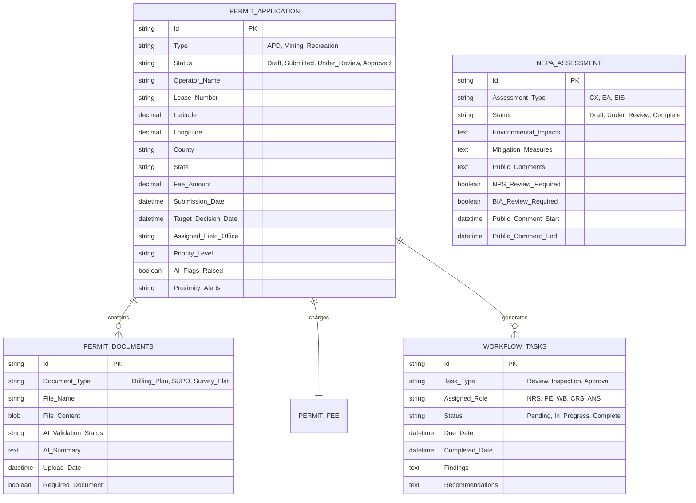
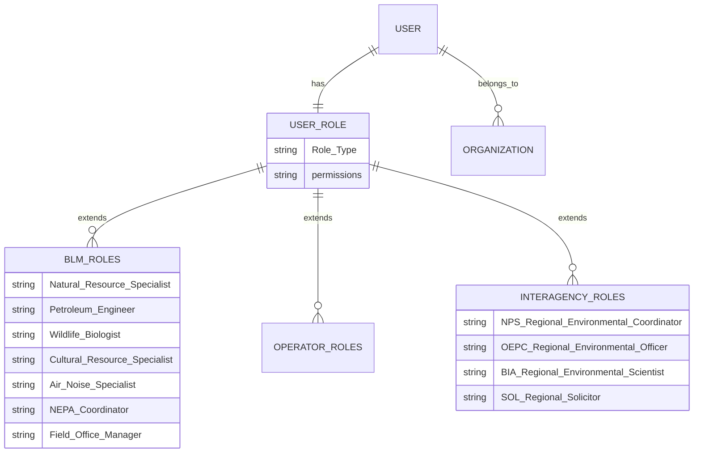

# Nuvi Permits and Licensing System - Complete Architecture & Implementation Guide

## Executive Summary

This document outlines the comprehensive architecture for a next-generation Nuvi Permits and Licensing application built on Salesforce platform. The system transforms the current 30+ day APD processing timeline into an AI-enhanced, streamlined workflow that significantly reduces Time-to-Delivery (TTD) while ensuring full regulatory compliance.

## System Overview

### Core Mission
- **Primary Goal**: Reduce permitting TTD from weeks to days
- **Secondary Goals**: Enhance operational efficiency, increase transparency, reduce economic impact
- **Technology Stack**: Salesforce LWR (Lightning Web Runtime), Apex, LWC, AI Services
- **Deployment Location**: `@force-app\main\Government_Documents\Permit_And_Licensing\`

### Key Performance Indicators
- Reduce APD processing time from 30+ days to 10-14 days
- 95% automation of document validation
- Real-time status visibility for operators
- Zero-touch routing for standard applications
- 90% SLA compliance across all workflows

## Business Context

### Use Case: White Sands National Park APD Processing
**Scenario**: Operator submits APD (Form 3160-3) for drilling near White Sands National Park, NM
- **Fee**: $12,515 per APD
- **Auto-routing**: Socorro Field Office (901 Old US Hwy 85, Socorro, NM 87801)
- **AI Detection**: Proximity to national park triggers enhanced review
- **Parallel Processing**: NPS and BIA reviews run simultaneously with EA workflow

### Regulatory Framework
- Federal Land Policy and Management Act (FLPMA)
- Mineral Leasing Act (MLA) 
- BLM regulations: 43 CFR Subpart 3162
- NEPA compliance requirements
- ESA, Clean Water Act, Marine Mammal Protection Act

## System Architecture

### 1. Application Layer Architecture

#### Public Portal (Operator Interface)
```
┌─ Permit Wizard ─────────────────────────────────┐
│  ├─ Permit Discovery & Recommendation Engine    │
│  ├─ Pre-Application Checklist Validation        │
│  ├─ Smart Form Auto-Population                  │
│  └─ Document Upload with AI Validation          │
└─────────────────────────────────────────────────┘

┌─ Application Management ────────────────────────┐
│  ├─ Multi-APD Package Submission               │
│  ├─ Real-time Status Tracking                  │
│  ├─ Payment Processing ($12,515 per APD)       │
│  └─ Notification & Communication Hub           │
└─────────────────────────────────────────────────┘
```

#### Internal Workspace (Agency Interface)
```
┌─ Case Management ──────────────────────────────┐
│  ├─ Unified Inbox with AI Prioritization      │
│  ├─ Collaborative Review Dashboard             │
│  ├─ Task Assignment & SLA Monitoring          │
│  └─ Multi-Agency Coordination Panel           │
└─────────────────────────────────────────────────┘

┌─ Specialized Tools ────────────────────────────┐
│  ├─ NEPA Environmental Assessment Builder     │
│  ├─ GIS Mapping & Proximity Analysis          │
│  ├─ Field Visit Scheduling System             │
│  └─ Document Generation & E-Signature         │
└─────────────────────────────────────────────────┘
```

### 2. Data Architecture

#### Core Objects Data Model



#### User & Organization Model



### 3. AI Services Architecture

#### Document Intelligence Pipeline
```
Document Upload
      ↓
AI Validation Engine
├─ Format Validation
├─ Content Completeness Check  
├─ Consistency Analysis
├─ Risk Assessment
└─ Auto-Summarization
      ↓
Validation Results
├─ Pass → Auto-Route to Review
├─ Issues Found → Return with Feedback
└─ Flags Raised → Priority Queue
```

#### Geospatial AI Analysis
```
Coordinate Input (Lat/Long, PLSS)
      ↓
GIS Proximity Engine
├─ National Parks (2-5 mile buffer)
├─ Cultural/Historic Sites
├─ Tribal Lands
├─ Wildlife Refuges
└─ Environmental Sensitive Areas
      ↓
Alert Generation
├─ Auto-trigger NEPA EA
├─ Add NPS/BIA review tasks
├─ Flag for enhanced scrutiny
└─ Suggest mitigation measures
```

### 4. Workflow Architecture

#### APD Processing Workflow (EA Track)

```
┌─ Submission Phase ─────────────────────────────┐
│ 1. Operator submits APD (Form 3160-3)         │
│ 2. AI validates documents & flags issues      │
│ 3. Payment processing ($12,515)               │
│ 4. Auto-route to jurisdiction field office    │
└────────────────────────────────────────────────┘
           ↓
┌─ Intake & Initial Review (5 days SLA) ────────┐
│ 1. NRS completeness check                     │
│ 2. AI summary generation                      │
│ 3. Proximity analysis & alert flagging        │
│ 4. NEPA level determination (CX/EA/EIS)       │
└────────────────────────────────────────────────┘
           ↓
┌─ Parallel Specialist Reviews (14 days SLA) ───┐
│ ├─ Petroleum Engineer (technical review)      │
│ ├─ Wildlife Biologist (species impact)        │
│ ├─ Cultural Resource Specialist (tribal/hist) │
│ ├─ Air/Noise Specialist (environmental)       │
│ └─ NPS Coordinator (park impact assessment)   │
└────────────────────────────────────────────────┘
           ↓
┌─ Field Visit & Inspection (7 days) ───────────┐
│ 1. OSI scheduling with calendar integration   │
│ 2. Multi-agency participation coordination    │
│ 3. Site assessment & mitigation planning      │
│ 4. Stakeholder consultation                   │
└────────────────────────────────────────────────┘
           ↓
┌─ EA Development & Review (14 days) ───────────┐
│ 1. NEPA Coordinator drafts EA                 │
│ 2. Specialist findings integration            │
│ 3. Peer review cycle                          │
│ 4. Field Office Manager clearance             │
└────────────────────────────────────────────────┘
           ↓
┌─ Interagency Review (10 days) ────────────────┐
│ ├─ NPS Regional Environmental Coordinator     │
│ ├─ OEPC Regional Environmental Officer        │
│ └─ SOL Regional Solicitor (legal review)      │
└────────────────────────────────────────────────┘
           ↓
┌─ Public Comment Period (14 days) ─────────────┐
│ 1. EA posting to public portal                │
│ 2. AI-powered comment collection/analysis     │
│ 3. Stakeholder feedback integration           │
│ 4. Final EA revision & FONSI generation       │
└────────────────────────────────────────────────┘
           ↓
┌─ Final Decision & Approval ───────────────────┐
│ 1. Field Office Manager signs EA/FONSI/DR    │
│ 2. APD approval with COAs                     │
│ 3. Operator notification                      │
│ 4. 30-day appeal period activation            │
└────────────────────────────────────────────────┘
```

### 5. Integration Architecture

#### External System Integrations
```
┌─ Government Systems ──────────────────────────┐
│ ├─ AFMSS (Application Filing & Management)   │
│ ├─ MLRS (Mineral & Land Records System)      │
│ ├─ Federal Register API                       │
│ ├─ Pay.gov (payment processing)              │
│ └─ ePlanning (NEPA document posting)         │
└────────────────────────────────────────────────┘

┌─ Authentication & Security ───────────────────┐
│ ├─ PIV Card Authentication                    │
│ ├─ OAuth 2.0 / SAML 2.0                      │
│ ├─ FedRAMP Compliance Framework               │
│ └─ ATO Security Documentation                 │
└────────────────────────────────────────────────┘

┌─ Geospatial & Mapping ────────────────────────┐
│ ├─ USGS National Map API                      │
│ ├─ BLM GIS Services                           │
│ ├─ NPS Geographic Data Services               │
│ └─ PLSS (Public Land Survey System)          │
└────────────────────────────────────────────────┘
```

## Technical Implementation

### Lightning Web Component Architecture

#### Core LWC Components

```javascript
// Permit Application Wizard
permit-application-wizard/
├── permit-application-wizard.html
├── permit-application-wizard.js
├── permit-application-wizard.css
└── permit-application-wizard.js-meta.xml

// Multi-step form with dynamic sections
// AI-powered document validation
// Real-time progress tracking
```

```javascript
// Case Management Dashboard  
case-management-dashboard/
├── case-management-dashboard.html
├── case-management-dashboard.js
├── case-management-dashboard.css
└── case-management-dashboard.js-meta.xml

// Unified inbox with filters
// SLA monitoring and alerts
// Collaborative workspace
```

```javascript
// GIS Mapping Component
gis-proximity-analyzer/
├── gis-proximity-analyzer.html
├── gis-proximity-analyzer.js
├── gis-proximity-analyzer.css
└── gis-proximity-analyzer.js-meta.xml

// Interactive mapping interface
// Proximity analysis visualization
// Environmental overlay layers
```

### Apex Service Architecture

#### Core Service Classes

```apex
// APD Processing Service
public with sharing class DOI_PAL_APDProcessingService {
    
    // Submit new APD application
    public static PermitApplicationResult submitAPD(APDSubmissionRequest request) {
        // Validate required documents
        // Process payment ($12,515)
        // Auto-route based on jurisdiction
        // Generate AI summary
        // Create workflow tasks
    }
    
    // Route application to field office
    public static void routeToFieldOffice(Id applicationId, String coordinates) {
        // Determine jurisdiction from coordinates
        // Assign to appropriate field office
        // Create initial review tasks
        // Set SLA timers
    }
    
    // Process document validation
    public static DocumentValidationResult validateDocuments(Id applicationId) {
        // Call AI validation service
        // Check for completeness
        // Flag inconsistencies
        // Generate feedback
    }
}
```

```apex
// NEPA Workflow Service  
public with sharing class DOI_PAL_NEPAWorkflowService {
    
    // Determine NEPA analysis level
    public static NEPAAnalysisLevel determineNEPALevel(Id applicationId) {
        // Analyze proximity to sensitive areas
        // Assess project complexity
        // Review historical decisions
        // Recommend CX/EA/EIS
    }
    
    // Create EA workflow
    public static void createEAWorkflow(Id applicationId) {
        // Generate specialist review tasks
        // Set up parallel reviews
        // Configure SLA timers
        // Add interagency coordination
    }
    
    // Generate EA document
    public static Document generateEADocument(Id applicationId) {
        // Compile specialist findings
        // Apply EA template
        // Include AI-generated summary
        // Format for public posting
    }
}
```

```apex
// AI Services Integration
public with sharing class DOI_PAL_AIServicesController {
    
    // Document summarization
    @AuraEnabled(cacheable=false)
    public static AISummaryResult generateDocumentSummary(Id documentId) {
        // Extract document content
        // Call AI summarization API
        // Store results
        // Return formatted summary
    }
    
    // Proximity analysis
    @AuraEnabled(cacheable=false) 
    public static ProximityAnalysisResult analyzeProximity(Decimal latitude, Decimal longitude) {
        // Query GIS services
        // Identify sensitive areas
        // Calculate distances
        // Generate alerts
    }
    
    // Risk assessment
    @AuraEnabled(cacheable=false)
    public static RiskAssessmentResult assessApplicationRisk(Id applicationId) {
        // Analyze application data
        // Review historical patterns
        // Identify risk factors
        // Recommend mitigation
    }
}
```

### Data Model Implementation

#### Custom Objects Schema

```apex
// Permit Application Object
DOI_PAL_Permit_Application__c {
    Name (Auto-generated: APD-{Year}-{Sequence})
    DOI_PAL_Application_Type__c (Picklist: APD, Mining, Recreation)
    DOI_PAL_Status__c (Picklist: Draft, Submitted, Under_Review, Approved, Denied)
    DOI_PAL_Operator_Name__c (Text, Required)
    DOI_PAL_Lease_Number__c (Text, Required)
    DOI_PAL_Latitude__c (Number(10,6))
    DOI_PAL_Longitude__c (Number(10,6))
    DOI_PAL_County__c (Text)
    DOI_PAL_State__c (Picklist: US States)
    DOI_PAL_Fee_Amount__c (Currency, Default: 12515)
    DOI_PAL_Submission_Date__c (DateTime)
    DOI_PAL_Target_Decision_Date__c (Date, Formula)
    DOI_PAL_Assigned_Field_Office__c (Text)
    DOI_PAL_Priority_Level__c (Picklist: Standard, High, Critical)
    DOI_PAL_AI_Flags__c (Long Text Area)
    DOI_PAL_Proximity_Alerts__c (Multi-Select Picklist)
    DOI_PAL_NEPA_Level__c (Picklist: CX, EA, EIS)
}
```

```apex
// Workflow Task Object
DOI_PAL_Workflow_Task__c {
    Name (Auto-generated: {Type}-{Sequence})
    DOI_PAL_Permit_Application__c (Master-Detail)
    DOI_PAL_Task_Type__c (Picklist: Review, Inspection, Approval, Public_Comment)
    DOI_PAL_Assigned_Role__c (Picklist: NRS, PE, WB, CRS, ANS, NEPA, FOM)
    DOI_PAL_Assigned_User__c (Lookup: User)
    DOI_PAL_Status__c (Picklist: Pending, In_Progress, Complete, On_Hold)
    DOI_PAL_Due_Date__c (Date, Required)
    DOI_PAL_Completed_Date__c (DateTime)
    DOI_PAL_SLA_Status__c (Formula: Green, Yellow, Red)
    DOI_PAL_Findings__c (Long Text Area)
    DOI_PAL_Recommendations__c (Long Text Area)
    DOI_PAL_Documents_Required__c (Checkbox)
    DOI_PAL_Priority_Order__c (Number)
}
```

### Security & Permissions Architecture

#### Profile Configuration
```apex
// BLM Field Office Staff Profile
- Object Permissions: CRUD on all permit objects
- Field Permissions: Edit all fields except system fields
- Apex Classes: Access to all DOI_PAL services
- Visualforce Pages: Access to internal interfaces
- Tab Visibility: All permit-related tabs

// Operator/Public Profile  
- Object Permissions: Read own permits, Create new applications
- Field Permissions: Edit application data, Read-only on status
- Apex Classes: Limited to public-facing services
- Visualforce Pages: Public portal only
- Tab Visibility: Application and status tabs only

// Interagency Review Profile
- Object Permissions: Read permits, Update assigned reviews
- Field Permissions: Edit review-specific fields only
- Apex Classes: Review and assessment services
- Visualforce Pages: Review interface access
- Tab Visibility: Review dashboard and assigned cases
```

#### Permission Sets
```apex
// Advanced AI Services Access
- Enhanced document analysis features
- Risk assessment tools
- Predictive analytics dashboard
- Historical pattern analysis

// GIS Admin Access
- Mapping configuration tools
- Geospatial analysis features
- Proximity rule configuration
- Boundary management tools

// Workflow Admin Access
- SLA configuration
- Task template management
- Notification rule setup
- Performance analytics
```

## Advanced Features

### AI-Powered Enhancements

#### 1. Intelligent Document Processing
- **Auto-extraction**: Extract key data from uploaded PDFs
- **Consistency checking**: Cross-reference data across documents
- **Gap analysis**: Identify missing or incomplete information
- **Risk scoring**: Flag high-risk applications for enhanced review

#### 2. Predictive Analytics
- **Processing time estimation**: Predict approval timeline based on complexity
- **Bottleneck identification**: Highlight potential delays
- **Resource optimization**: Suggest optimal task assignment
- **Success probability**: Estimate approval likelihood

#### 3. Natural Language Processing  
- **Comment analysis**: Categorize and summarize public comments
- **Stakeholder sentiment**: Analyze feedback tone and themes
- **Auto-response generation**: Draft standard responses
- **Translation services**: Multi-language support for tribal consultation

### Advanced Workflow Features

#### 1. Dynamic Process Adaptation
- **Smart routing**: Automatically adjust workflow based on application characteristics
- **Parallel optimization**: Maximize concurrent processing opportunities
- **Exception handling**: Intelligent rerouting for complex cases
- **Stakeholder coordination**: Auto-schedule multi-party reviews

#### 2. Real-time Collaboration
- **Shared workspaces**: Collaborative document editing
- **Communication hub**: Integrated messaging and video conferencing  
- **Decision support**: AI-powered recommendation engine
- **Knowledge management**: Searchable expertise database

#### 3. Public Engagement Platform
- **Interactive mapping**: Public visualization of proposed projects
- **Comment portal**: Structured feedback collection
- **Notification system**: Stakeholder alert mechanisms
- **Transparency dashboard**: Real-time process visibility

### Performance & Scalability

#### 1. Governor Limit Optimization
- **Bulk processing**: Handle multiple applications efficiently
- **Asynchronous operations**: Long-running processes in background
- **Caching strategies**: Minimize API calls and database queries
- **Resource pooling**: Shared processing resources

#### 2. Monitoring & Analytics
- **Performance dashboards**: Real-time system health monitoring
- **SLA tracking**: Automated compliance reporting  
- **User analytics**: Behavior analysis and optimization
- **Capacity planning**: Resource requirement forecasting

## Implementation Roadmap

### Phase 1: Foundation (Weeks 1-4)
- [ ] Set up core data model and objects
- [ ] Implement basic security and permissions
- [ ] Create foundational Apex services
- [ ] Build core LWC components
- [ ] Establish integration framework

### Phase 2: Core Functionality (Weeks 5-8)
- [ ] Build APD application wizard
- [ ] Implement workflow engine
- [ ] Create case management dashboard
- [ ] Add document upload and validation
- [ ] Integrate payment processing

### Phase 3: AI & Automation (Weeks 9-12)
- [ ] Deploy AI document analysis
- [ ] Implement proximity analysis
- [ ] Add predictive analytics
- [ ] Create intelligent routing
- [ ] Build recommendation engine

### Phase 4: Advanced Features (Weeks 13-16)
- [ ] Complete NEPA workflow automation
- [ ] Add public comment platform
- [ ] Implement advanced reporting
- [ ] Create mobile-responsive interface
- [ ] Deploy performance monitoring

### Phase 5: Integration & Testing (Weeks 17-20)
- [ ] Complete external system integrations
- [ ] Perform end-to-end testing
- [ ] Conduct security assessment
- [ ] Execute user acceptance testing
- [ ] Prepare production deployment

## Success Metrics

### Quantitative Measures
- **Time to Delivery**: Reduce average processing time by 50%
- **Automation Rate**: Achieve 85% automated initial processing
- **SLA Compliance**: Maintain 95% on-time task completion
- **User Satisfaction**: 90% positive feedback from operators
- **Cost Reduction**: Decrease processing cost per application by 40%

### Qualitative Measures
- **Process Transparency**: Real-time visibility into all stages
- **Stakeholder Engagement**: Enhanced public participation
- **Decision Quality**: More consistent and well-documented decisions
- **Regulatory Compliance**: Full adherence to federal requirements
- **Innovation Leadership**: Establish Nuvi as digital government leader

## Risk Management

### Technical Risks
- **Integration complexity**: Phased approach with fallback options
- **Performance challenges**: Load testing and optimization
- **Data security**: Enhanced encryption and access controls
- **System availability**: Redundancy and disaster recovery

### Operational Risks
- **User adoption**: Comprehensive training and change management
- **Process changes**: Gradual transition with parallel operation
- **Compliance gaps**: Legal review and validation checkpoints
- **Resource constraints**: Cross-training and knowledge sharing

## Conclusion

This comprehensive architecture provides a roadmap for transforming Nuvi's permit processing capabilities through innovative use of Salesforce platform features, AI integration, and modern user experience design. The system will significantly reduce processing times while enhancing transparency, compliance, and stakeholder engagement.

The modular architecture ensures scalability to handle the full spectrum of Nuvi's 23+ permit types, while the AI-powered automation capabilities position the department at the forefront of digital government services.

Implementation success depends on close collaboration between technical teams, subject matter experts, and end users throughout the development lifecycle. The phased approach allows for iterative refinement and continuous improvement based on real-world usage and feedback.

---
*Document Version: 1.0*  
*Last Updated: September 3, 2025*  
*Contact: Salesforce Development Team*
 
## Addendum: Integrations, Events, and LWR Notes

- Payments: Pay.gov (Named Credential: PayGov). The example callout code is commented out until integration is available. Tests use safe fallbacks. Configure the Named Credential and CSP Trusted Sites when ready.
- GIS: ArcGIS REST (Trusted Sites). Use `GISProximityService` as a placeholder until endpoints are configured. Replace with real REST invocations when service details are available.
- Platform Events: `Nuvi_Permit_Status_Change__e` is provided (ApplicationId, Stage, Message). Publish via `StatusEventPublisher.publishStatusChange()` after key transitions. Subscribe using Apex triggers for notifications and dashboards.
- LWR/Experience Cloud: Use LWR pages (LWC-only). Add `nuviPermitApplicationWizard`, `nuviPermitDocumentManager`, `nuviPermitSignatureManager`, and `permitMap` to appropriate pages. Ensure CSP Trusted Sites include external LLMs, ArcGIS, and Pay.gov.


