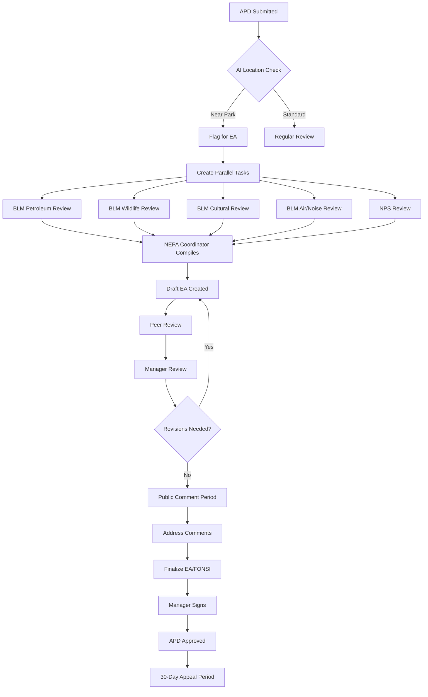

# DOI Drilling Permits Application - Complete End-to-End Implementation Blueprint

## Table of Contents
1. System Overview & Architecture
2. Complete Page-by-Page Application Flow
3. Detailed Workflow Processes
4. Approval Matrix & Routing Logic
5. Salesforce PSS Integration Components
6. User Interface Specifications
7. Business Rules Engine
8. Notification & Communication Framework
9. Reporting & Analytics Requirements

---

## 1. SYSTEM OVERVIEW & ARCHITECTURE

### Application Ecosystem

```
┌─────────────────────────────────────────────────────────────────┐
│                     DOI PERMITS PLATFORM                         │
├─────────────────────────────────────────────────────────────────┤
│                                                                   │
│  ┌──────────────┐  ┌──────────────┐  ┌──────────────┐          │
│  │   PUBLIC     │  │   AGENCY     │  │   ADMIN      │          │
│  │   PORTAL     │  │   WORKSPACE  │  │   CONSOLE    │          │
│  └──────────────┘  └──────────────┘  └──────────────┘          │
│         │                 │                  │                   │
│  ┌──────────────────────────────────────────────────────┐       │
│  │           SALESFORCE PUBLIC SECTOR CLOUD              │       │
│  ├──────────────────────────────────────────────────────┤       │
│  │  • Licensing & Permitting     • Business Rules Engine │       │
│  │  • Inspection Management       • Document Generation  │       │
│  │  • Case Management            • Payment Processing    │       │
│  │  • Workflow Automation        • Portal Experience     │       │
│  └──────────────────────────────────────────────────────┘       │
│                                                                   │
│  ┌──────────────────────────────────────────────────────┐       │
│  │              INTEGRATION LAYER                        │       │
│  ├──────────────────────────────────────────────────────┤       │
│  │  Einstein AI  │ Pay.gov │ Login.gov │ ESRI GIS │     │       │
│  └──────────────────────────────────────────────────────┘       │
└─────────────────────────────────────────────────────────────────┘
```

---

## 2. COMPLETE PAGE-BY-PAGE APPLICATION FLOW

### PUBLIC PORTAL - OPERATOR/APPLICANT EXPERIENCE

#### **PAGE 1: Landing Page & Authentication**

```
URL: /permits/home

LAYOUT:
┌────────────────────────────────────────────────────────┐
│  [DOI Logo]  Bureau of Land Management                  │
│  ─────────────────────────────────────────────────────  │
│                                                          │
│  DRILLING PERMIT APPLICATION SYSTEM                     │
│                                                          │
│  ┌──────────────────────────────────────┐             │
│  │  [Apply for New Permit]                │             │
│  │  [Check Application Status]            │             │
│  │  [Manage Existing Permits]             │             │
│  │  [Help & Resources]                    │             │
│  └──────────────────────────────────────┘             │
│                                                          │
│  LOGIN OPTIONS:                                         │
│  [Login.gov] [Create Account] [Agency Login]           │
└────────────────────────────────────────────────────────┘

COMPONENTS:
- experiencecloud:landingPage
- pss:authenticationPanel
- Custom LWC: permitQuickActions
```

#### **PAGE 2: Operator Dashboard (Post-Login)**

```
URL: /permits/dashboard

LAYOUT:
┌────────────────────────────────────────────────────────┐
│  Welcome, [Operator Name] | Company: [Company Name]     │
│  ─────────────────────────────────────────────────────  │
│                                                          │
│  ┌─────────────────────────────────────┐              │
│  │  QUICK STATS                         │              │
│  │  Active Permits: 12                  │              │
│  │  Pending Applications: 3             │              │
│  │  Actions Required: 2                 │              │
│  └─────────────────────────────────────┘              │
│                                                          │
│  MY APPLICATIONS                                        │
│  ┌─────────────────────────────────────────────────┐  │
│  │ APD# │ Location │ Status │ Days │ Actions       │  │
│  │ 2025-001 │ NM │ Review │ 12 │ [View][Upload]    │  │
│  │ 2025-002 │ NM │ Draft │ 3 │ [Continue][Delete]  │  │
│  └─────────────────────────────────────────────────┘  │
│                                                          │
│  [+ Start New Application]                              │
└────────────────────────────────────────────────────────┘

SALESFORCE PSS COMPONENTS USED:
- pss:licenseDashboard
- pss:applicationList
- lightning:datatable with inline actions
```

#### **PAGE 3: Pre-Application Wizard**

```
URL: /permits/pre-check

STEP 1: Eligibility Check
┌────────────────────────────────────────────────────────┐
│  BEFORE YOU BEGIN                                       │
│  ─────────────────────────────────────────────────────  │
│                                                          │
│  Please confirm the following requirements:             │
│                                                          │
│  □ I have a valid Federal Oil & Gas Lease              │
│    Lease Number: [_______________]                      │
│    [Verify Lease]                                       │
│                                                          │
│  □ I have obtained necessary Surface Access Rights      │
│    Type: [Federal/Private/State/Tribal ▼]              │
│    Agreement #: [_______________]                       │
│                                                          │
│  □ I have an active bond on file                       │
│    Bond Type: [Statewide/Individual/Nationwide ▼]      │
│    Bond Number: [_______________]                       │
│    [Verify Bond]                                        │
│                                                          │
│  □ Environmental clearances initiated (if applicable)   │
│                                                          │
│  [Back] [Save & Exit] [Continue →]                     │
└────────────────────────────────────────────────────────┘

VALIDATION RULES:
- Real-time lease verification against BLM database
- Bond validation with minimum coverage check ($10,000 individual/$25,000 statewide)
- Surface rights documentation upload if private/tribal
```

#### **PAGE 4: APD Form - Section 1: Operator Information**

```
URL: /permits/apd/operator-info

┌────────────────────────────────────────────────────────┐
│  APPLICATION FOR PERMIT TO DRILL (Form 3160-3)          │
│  Section 1 of 8: Operator Information                   │
│  ─────────────────────────────────────────────────────  │
│                                                          │
│  OPERATOR DETAILS (Auto-populated from profile)        │
│                                                          │
│  Legal Entity Name*: [ACME Oil & Gas Corp    ]         │
│  DBA/Trade Name:    [ACME Drilling           ]         │
│  Tax ID (EIN)*:     [XX-XXXXXXX              ]         │
│  BLM Operator Code: [12345                   ]         │
│                                                          │
│  PRIMARY ADDRESS                                        │
│  Street*:           [123 Energy Drive        ]         │
│  City*:             [Houston                 ]         │
│  State*:            [Texas ▼                 ]         │
│  ZIP*:              [77001                   ]         │
│                                                          │
│  AUTHORIZED REPRESENTATIVE                              │
│  Name*:             [John Smith               ]         │
│  Title*:            [Drilling Manager         ]         │
│  Phone*:            [(555) 123-4567          ]         │
│  Email*:            [jsmith@acmeoil.com      ]         │
│  Alt Phone:         [(555) 123-4568          ]         │
│                                                          │
│  BONDING INFORMATION                                    │
│  Bond Type*:        [Statewide ▼             ]         │
│  Bond Number*:      [NM-BOND-2024-001        ]         │
│  Bond Amount:       [$25,000                 ]         │
│  Surety Company:    [Liberty Mutual          ]         │
│                                                          │
│  [← Previous] [Save Draft] [Next Section →]            │
└────────────────────────────────────────────────────────┘
```

#### **PAGE 5: APD Form - Section 2: Well Location & Lease**

```
URL: /permits/apd/well-location

┌────────────────────────────────────────────────────────┐
│  Section 2 of 8: Well Location & Lease Information      │
│  ─────────────────────────────────────────────────────  │
│                                                          │
│  LEASE INFORMATION                                      │
│  Federal Lease #*:  [NM-087654               ]         │
│  [Verify Lease Status]                                  │
│                                                          │
│  Unit/CA Agreement: [Southwest Unit Agreement]         │
│  Agreement #:       [NM-UA-2023-45           ]         │
│                                                          │
│  WELL IDENTIFICATION                                    │
│  Well Name*:        [ACME Fed 23-14 #1H      ]         │
│  Well Number*:      [001H                    ]         │
│  API Number:        [30-025-12345            ]         │
│                                                          │
│  LOCATION ENTRY METHOD                                  │
│  ○ PLSS (Public Land Survey System)                    │
│  ● Latitude/Longitude                                   │
│  ○ Import from Shapefile                                │
│                                                          │
│  SURFACE LOCATION (NAD 83)                             │
│  Latitude*:         [32.123456               ]         │
│  Longitude*:        [-104.987654             ]         │
│  [View on Map]                                          │
│                                                          │
│  PLSS LOCATION                                          │
│  State*:            [New Mexico ▼            ]         │
│  Meridian*:         [New Mexico Principal ▼  ]         │
│  Township*:         [23S                     ]         │
│  Range*:            [32E                     ]         │
│  Section*:          [14                      ]         │
│  Quarter-Quarter*:  [NW NE                   ]         │
│                                                          │
│  ELEVATION                                               │
│  Ground Level (ft MSL)*: [3,456              ]         │
│                                                          │
│  AI PROXIMITY CHECK                                     │
│  ┌─────────────────────────────────────────┐          │
│  │ ⚠ Location Analysis Results:            │          │
│  │ • 3.2 miles from White Sands Natl Park  │          │
│  │ • 8.5 miles from Mescalero Apache Lands │          │
│  │ • Outside critical habitat areas        │          │
│  │ [View Detailed Analysis]                │          │
│  └─────────────────────────────────────────┘          │
│                                                          │
│  [← Previous] [Save Draft] [Next Section →]            │
└────────────────────────────────────────────────────────┘
```

#### **PAGE 6: APD Form - Section 3: Well Design & Drilling Plan**

```
URL: /permits/apd/drilling-plan

┌────────────────────────────────────────────────────────┐
│  Section 3 of 8: Well Design & Drilling Plan            │
│  ─────────────────────────────────────────────────────  │
│                                                          │
│  WELL CLASSIFICATION                                    │
│  Well Type*:        [Oil ▼                   ]         │
│  Well Purpose*:     [Production ▼            ]         │
│  Well Profile*:     [Horizontal ▼            ]         │
│                                                          │
│  DEPTH INFORMATION                                      │
│  Proposed MD (ft)*: [12,500                  ]         │
│  Proposed TVD (ft)*:[8,750                   ]         │
│  Kickoff Point (ft):[3,200                   ]         │
│                                                          │
│  TARGET FORMATION                                       │
│  Formation Name*:   [Wolfcamp B              ]         │
│  Expected Depth:    [8,500-8,800 ft          ]         │
│                                                          │
│  DRILLING PLAN UPLOAD                                   │
│  ┌─────────────────────────────────────────┐          │
│  │ Required Documents:                      │          │
│  │                                          │          │
│  │ ✓ Drilling Program    [View][Replace]   │          │
│  │   drilling_plan_v2.pdf (2.3 MB)         │          │
│  │                                          │          │
│  │ ⧖ Wellbore Diagram    [Upload]          │          │
│  │                                          │          │
│  │ ⧖ Casing Design       [Upload]          │          │
│  │                                          │          │
│  │ + Add Additional Documents               │          │
│  └─────────────────────────────────────────┘          │
│                                                          │
│  AI DOCUMENT EXTRACTION                                 │
│  [Extract Data from Documents]                          │
│                                                          │
│  ┌─────────────────────────────────────────┐          │
│  │ Extracted Information:                   │          │
│  │ • Casing: 13-3/8" surface @ 3,200'      │          │
│  │ • Casing: 9-5/8" intermediate @ 7,500'  │          │
│  │ • Casing: 5-1/2" production @ TD        │          │
│  │ • Mud Weight: 9.2-12.5 ppg              │          │
│  │ • BOP: 10K Annular + Double Ram         │          │
│  │ [Accept] [Edit Extracted Data]          │          │
│  └─────────────────────────────────────────┘          │
│                                                          │
│  [← Previous] [Save Draft] [Next Section →]            │
└────────────────────────────────────────────────────────┘
```

#### **PAGE 7: APD Form - Section 4: Surface Use Plan (SUPO)**

```
URL: /permits/apd/surface-plan

┌────────────────────────────────────────────────────────┐
│  Section 4 of 8: Surface Use Plan of Operations         │
│  ─────────────────────────────────────────────────────  │
│                                                          │
│  WELL PAD INFORMATION                                   │
│  New or Existing:   [New Construction ▼      ]         │
│  Pad Size (acres)*: [3.5                     ]         │
│  Pad Name/ID:       [ACME 23-14 Pad          ]         │
│                                                          │
│  ACCESS ROADS                                           │
│  New Road Length:   [0.25 miles              ]         │
│  Road Width:        [24 feet                 ]         │
│  Existing Road Use: [County Road 234 - 2 mi  ]         │
│                                                          │
│  SURFACE DISTURBANCE                                    │
│  Total Disturbance*:[4.2 acres               ]         │
│  Temp Disturbance:  [1.5 acres               ]         │
│  Perm Disturbance:  [2.7 acres               ]         │
│                                                          │
│  WATER RESOURCES                                        │
│  Water Source*:     [Municipal ▼             ]         │
│  Provider:          [City of Carlsbad        ]         │
│  Est. Volume:       [250,000 gallons         ]         │
│  Transport Method:  [Truck ▼                 ]         │
│                                                          │
│  WASTE MANAGEMENT                                       │
│  Drilling Fluids:   [Closed-loop system ▼    ]         │
│  Cuttings Disposal: [Onsite burial ▼         ]         │
│  Produced Water:    [Injection well - SWD#123]         │
│                                                          │
│  RECLAMATION PLAN                                       │
│  Interim Reclamation Timeline: [6 months     ]         │
│  Final Reclamation Timeline:   [End of life  ]         │
│  Revegetation Method:          [Native seed mix ▼]     │
│                                                          │
│  SUPO DOCUMENT UPLOAD                                   │
│  [Upload Complete SUPO Document]                        │
│  ✓ SUPO_complete_v3.pdf (4.1 MB)                      │
│                                                          │
│  [← Previous] [Save Draft] [Next Section →]            │
└────────────────────────────────────────────────────────┘
```

#### **PAGE 8: APD Form - Section 5: Environmental & Cultural**

```
URL: /permits/apd/environmental

┌────────────────────────────────────────────────────────┐
│  Section 5 of 8: Environmental & Cultural Resources     │
│  ─────────────────────────────────────────────────────  │
│                                                          │
│  ENVIRONMENTAL SURVEYS                                  │
│                                                          │
│  Biological Survey Required: [Yes ▼          ]         │
│  Survey Date:               [01/15/2025      ]         │
│  Survey Company:            [EcoConsult LLC  ]         │
│  [Upload Biological Survey Report]                      │
│  ✓ bio_survey_2025.pdf                                 │
│                                                          │
│  T&E Species Present:       [No ▼            ]         │
│  Migratory Birds:          [Seasonal restrictions]     │
│  Critical Habitat:         [None identified  ]         │
│                                                          │
│  CULTURAL RESOURCES                                     │
│                                                          │
│  Class III Survey Complete: [Yes ▼           ]         │
│  SHPO Consultation:        [Not required ▼   ]         │
│  Tribal Consultation:      [Pending ▼        ]         │
│  Sites Identified:         [None             ]         │
│  [Upload Cultural Report]                               │
│  ✓ cultural_clearance_2025.pdf                         │
│                                                          │
│  AIR QUALITY                                            │
│  Within Non-Attainment Area: [No ▼          ]         │
│  Est. Annual Emissions (TPY):                          │
│  • NOx:  [12.5                               ]         │
│  • VOC:  [8.3                                ]         │
│  • CO:   [15.2                               ]         │
│  • PM10: [2.1                                ]         │
│                                                          │
│  VISUAL & NOISE                                         │
│  Nearest Residence:   [2.3 miles             ]         │
│  Nearest Park Entry:  [3.2 miles             ]         │
│  Visual Mitigation:   [Earth-tone paint ▼    ]         │
│  Noise Mitigation:    [Sound barriers ▼      ]         │
│                                                          │
│  [← Previous] [Save Draft] [Next Section →]            │
└────────────────────────────────────────────────────────┘
```

#### **PAGE 9: APD Form - Section 6: Additional Operators & Insurance**

```
URL: /permits/apd/additional-info

┌────────────────────────────────────────────────────────┐
│  Section 6 of 8: Additional Operators & Insurance       │
│  ─────────────────────────────────────────────────────  │
│                                                          │
│  PARTICIPATING OPERATORS                                │
│  Are there other operators?: [Yes ▼          ]         │
│                                                          │
│  ┌─────────────────────────────────────────┐          │
│  │ Operator Name    │ Interest │ Role      │          │
│  │ XYZ Energy LLC   │ 25%     │ Non-Op    │          │
│  │ ABC Oil Corp     │ 15%     │ Non-Op    │          │
│  │ [+ Add Operator]                        │          │
│  └─────────────────────────────────────────┘          │
│                                                          │
│  INSURANCE INFORMATION                                  │
│  General Liability Coverage*: [$5,000,000    ]         │
│  Policy Number*:             [GL-2025-123456 ]         │
│  Carrier*:                   [State Farm     ]         │
│  Expiration Date*:           [12/31/2025     ]         │
│                                                          │
│  Pollution Liability:         [$10,000,000   ]         │
│  Policy Number:              [PL-2025-789012 ]         │
│                                                          │
│  EMERGENCY RESPONSE                                     │
│  24-Hour Contact Name*:  [Mike Johnson       ]         │
│  24-Hour Phone*:         [(555) 999-8888     ]         │
│  Spill Response Plan:    [On file with BLM ▼ ]         │
│  [Upload Updated Spill Plan]                            │
│                                                          │
│  H2S CONTINGENCY (if applicable)                       │
│  H2S Expected:           [No ▼               ]         │
│                                                          │
│  [← Previous] [Save Draft] [Next Section →]            │
└────────────────────────────────────────────────────────┘
```

#### **PAGE 10: APD Form - Section 7: Related APDs & Sundry Notices**

```
URL: /permits/apd/related-applications

┌────────────────────────────────────────────────────────┐
│  Section 7 of 8: Related Applications                   │
│  ─────────────────────────────────────────────────────  │
│                                                          │
│  RELATED APD APPLICATIONS                               │
│  Is this part of a multi-well project?: [Yes ▼]        │
│                                                          │
│  Related APDs (Package Submission):                     │
│  ┌─────────────────────────────────────────┐          │
│  │ □ Create new related APD                │          │
│  │ □ Link to existing APD                  │          │
│  │                                          │          │
│  │ Linked APDs:                            │          │
│  │ • APD-2025-002 (ACME Fed 23-14 #2H)   │          │
│  │ • APD-2025-003 (ACME Fed 23-14 #3H)   │          │
│  │                                          │          │
│  │ [View Package Summary]                  │          │
│  └─────────────────────────────────────────┘          │
│                                                          │
│  PREVIOUS SUNDRY NOTICES                                │
│  Related Sundry Notices on this lease:                  │
│  • SN-2024-445: Temporary Abandonment                   │
│  • SN-2024-223: Workover Operations                     │
│                                                          │
│  MASTER DEVELOPMENT PLAN                                │
│  Part of approved MDP?: [No ▼                ]         │
│                                                          │
│  COMMENTS FOR REVIEWER                                  │
│  ┌─────────────────────────────────────────┐          │
│  │ Please note this is the first of three  │          │
│  │ wells planned for this pad. We request  │          │
│  │ concurrent review of all three APDs.    │          │
│  └─────────────────────────────────────────┘          │
│                                                          │
│  [← Previous] [Save Draft] [Next Section →]            │
└────────────────────────────────────────────────────────┘
```

#### **PAGE 11: APD Form - Section 8: Review & Submit**

```
URL: /permits/apd/review-submit

┌────────────────────────────────────────────────────────┐
│  Section 8 of 8: Review & Submit                        │
│  ─────────────────────────────────────────────────────  │
│                                                          │
│  APPLICATION SUMMARY                                    │
│                                                          │
│  ┌─────────────────────────────────────────┐          │
│  │ AI COMPLETENESS CHECK                   │          │
│  │ ✓ All required fields complete          │          │
│  │ ✓ All required documents uploaded       │          │
│  │ ⚠ 2 Warnings:                          │          │
│  │   - Proximity to National Park (3.2 mi) │          │
│  │   - Tribal consultation pending         │          │
│  │ ✓ Fee calculated: $12,515              │          │
│  └─────────────────────────────────────────┘          │
│                                                          │
│  REVIEW SECTIONS                                        │
│  ┌─────────────────────────────────────────┐          │
│  │ Section              Status    Action    │          │
│  │ 1. Operator Info     ✓ Complete [Edit]  │          │
│  │ 2. Well Location     ✓ Complete [Edit]  │          │
│  │ 3. Drilling Plan     ✓ Complete [Edit]  │          │
│  │ 4. Surface Plan      ✓ Complete [Edit]  │          │
│  │ 5. Environmental     ✓ Complete [Edit]  │          │
│  │ 6. Insurance         ✓ Complete [Edit]  │          │
│  │ 7. Related APDs      ✓ Complete [Edit]  │          │
│  └─────────────────────────────────────────┘          │
│                                                          │
│  [Download PDF Preview]                                 │
│                                                          │
│  CERTIFICATION                                          │
│  □ I certify that all information provided is true     │
│    and accurate to the best of my knowledge            │
│  □ I understand false statements are punishable        │
│    under 18 U.S.C. 1001                                │
│  □ I am authorized to submit on behalf of operator     │
│                                                          │
│  Signature: [Digital Signature Pad]                     │
│  Name: John Smith     Date: 01/20/2025                 │
│                                                          │
│  [← Previous] [Save Draft] [Proceed to Payment →]      │
└────────────────────────────────────────────────────────┘
```

#### **PAGE 12: Payment Processing**

```
URL: /permits/apd/payment

┌────────────────────────────────────────────────────────┐
│  PAYMENT FOR APD APPLICATION                            │
│  ─────────────────────────────────────────────────────  │
│                                                          │
│  FEE SUMMARY                                            │
│  ┌─────────────────────────────────────────┐          │
│  │ Description              Amount          │          │
│  │ APD Base Fee:            $10,220         │          │
│  │ Processing Fee:          $2,295          │          │
│  │ Package Discount (3):    -$1,000         │          │
│  │ ─────────────────────────────         │          │
│  │ Total Due:               $12,515         │          │
│  └─────────────────────────────────────────┘          │
│                                                          │
│  PAYMENT METHOD                                         │
│  ○ Pay.gov (Recommended)                                │
│  ○ ACH Transfer                                         │
│  ○ Wire Transfer                                        │
│  ● Credit Card                                          │
│                                                          │
│  CREDIT CARD INFORMATION                                │
│  Card Number:    [4111 1111 1111 1111]                 │
│  Expiry:         [12/27]                                │
│  CVV:            [123]                                  │
│  Name on Card:   [John Smith]                           │
│                                                          │
│  BILLING ADDRESS                                        │
│  □ Same as operator address                             │
│                                                          │
│  [← Back to Review] [Process Payment]                   │
│                                                          │
│  🔒 Secure payment processed through Pay.gov            │
└────────────────────────────────────────────────────────┘
```

#### **PAGE 13: Submission Confirmation**

```
URL: /permits/apd/confirmation

┌────────────────────────────────────────────────────────┐
│  APPLICATION SUBMITTED SUCCESSFULLY                     │
│  ─────────────────────────────────────────────────────  │
│                                                          │
│  ✓ Your APD has been submitted                         │
│                                                          │
│  APPLICATION DETAILS                                    │
│  ┌─────────────────────────────────────────┐          │
│  │ APD Number:     APD-2025-001             │          │
│  │ Well Name:      ACME Fed 23-14 #1H       │          │
│  │ Submit Date:    01/20/2025 2:45 PM MST   │          │
│  │ Payment Ref:    PAY-2025-456789          │          │
│  │ Status:         Under Review              │          │
│  └─────────────────────────────────────────┘          │
│                                                          │
│  ASSIGNED TO                                            │
│  Socorro Field Office                                   │
│  901 Old US Hwy 85, Socorro, NM 87801                  │
│  Phone: (575) 835-0412                                  │
│                                                          │
│  WHAT HAPPENS NEXT                                      │
│  1. Initial review within 5 business days               │
│  2. Technical review by specialists                     │
│  3. You'll be notified of any issues                   │
│  4. Decision expected within 30 days                    │
│                                                          │
│  TRACK YOUR APPLICATION                                 │
│  [View Application Status]                              │
│  [Download Receipt PDF]                                 │
│  [Return to Dashboard]                                  │
│                                                          │
│  You will receive email updates at:                     │
│  jsmith@acmeoil.com                                    │
└────────────────────────────────────────────────────────┘
```

---

### AGENCY WORKSPACE - BLM STAFF EXPERIENCE

#### **PAGE 14: BLM Staff Dashboard**

```
URL: /workspace/dashboard

┌────────────────────────────────────────────────────────┐
│  BLM WORKSPACE - Socorro Field Office                   │
│  User: Sarah Martinez (Natural Resource Specialist)     │
│  ─────────────────────────────────────────────────────  │
│                                                          │
│  MY WORKLOAD                                            │
│  ┌─────────────────────────────────────────┐          │
│  │ Assigned Tasks:        12                │          │
│  │ Overdue:               2                 │          │
│  │ Due This Week:         5                 │          │
│  │ Awaiting Response:     3                 │          │
│  └─────────────────────────────────────────┘          │
│                                                          │
│  PRIORITY QUEUE                                         │
│  ┌──────────────────────────────────────────────────┐ │
│  │ APD# │ Operator │ Days │ Task │ Priority │ SLA  │ │
│  │ 2025-001│ACME │ 3 │Intake Review│ HIGH │ 2 days│ │
│  │ 2024-998│XYZ  │ 12│Tech Review │ MED │ 5 days │ │
│  └──────────────────────────────────────────────────┘ │
│                                                          │
│  TEAM CALENDAR                                          │
│  Today: 2 Field Visits, 1 Team Meeting                  │
│  [View Full Calendar]                                   │
│                                                          │
│  QUICK ACTIONS                                          │
│  [New APD Search] [Reports] [Field Visit Schedule]     │
└────────────────────────────────────────────────────────┘

SALESFORCE PSS COMPONENTS:
- pss:caseWorkbench
- pss:taskManager
- lightning:calendar
```

#### **PAGE 15: APD Intake Review Screen**

```
URL: /workspace/apd/intake-review

┌────────────────────────────────────────────────────────┐
│  APD INTAKE REVIEW - APD-2025-001                       │
│  ─────────────────────────────────────────────────────  │
│                                                          │
│  ┌─────────────────────────────────────────┐          │
│  │ AI SUMMARY                               │          │
│  │ • Well Type: Horizontal Oil             │          │
│  │ • Location: 3.2 mi from White Sands NP  │          │
│  │ • Depth: 12,500' MD / 8,750' TVD       │          │
│  │ • ⚠ Triggers EA due to park proximity   │          │
│  │ • All required docs present             │          │
│  │ • Fee paid: $12,515                     │          │
│  └─────────────────────────────────────────┘          │
│                                                          │
│  COMPLETENESS CHECKLIST                                 │
│  ┌─────────────────────────────────────────┐          │
│  │ Document              Status   Action    │          │
│  │ ✓ Form 3160-3        Complete  [View]   │          │
│  │ ✓ Drilling Plan      Uploaded  [View]   │          │
│  │ ✓ SUPO              Uploaded  [View]   │          │
│  │ ✓ Survey Plat       Uploaded  [View]   │          │
│  │ ✓ Bio Survey        Uploaded  [View]   │          │
│  │ ✓ Cultural Report   Uploaded  [View]   │          │
│  │ ✓ Bond Verification Valid     [Verify]  │          │
│  │ ✓ Payment           Confirmed  [Receipt]│          │
│  └─────────────────────────────────────────┘          │
│                                                          │
│  VALIDATION RESULTS                                     │
│  ┌─────────────────────────────────────────┐          │
│  │ ✓ Lease NM-087654 active until 2028     │          │
│  │ ✓ Operator bond sufficient              │          │
│  │ ✓ Location within lease boundaries      │          │
│  │ ⚠ NPS consultation required             │          │
│  │ ⚠ Tribal notification pending           │          │
│  └─────────────────────────────────────────┘          │
│                                                          │
│  NEPA DETERMINATION                                     │
│  Recommended Level: [Environmental Assessment (EA) ▼]  │
│  Justification: Proximity to National Park              │
│                                                          │
│  INTAKE DECISION                                        │
│  ○ Accept - Proceed to Technical Review                │
│  ○ Return - Missing Information                         │
│  ○ Hold - Pending Clarification                        │
│                                                          │
│  Comments: [                                 ]          │
│                                                          │
│  [Save Progress] [Request Info] [Complete Intake]      │
└────────────────────────────────────────────────────────┘
```

#### **PAGE 16: Technical Review Assignment**

```
URL: /workspace/apd/assign-reviews

┌────────────────────────────────────────────────────────┐
│  ASSIGN TECHNICAL REVIEWS - APD-2025-001                │
│  ─────────────────────────────────────────────────────  │
│                                                          │
│  EA WORKFLOW - PARALLEL REVIEWS                         │
│                                                          │
│  BLM SPECIALIST ASSIGNMENTS                             │
│  ┌─────────────────────────────────────────┐          │
│  │ Role                 Assignee    SLA     │          │
│  │ Petroleum Engineer   Tom Chen    14 days │          │
│  │   [Change ▼]                             │          │
│  │ Wildlife Biologist   Amy Ross    14 days │          │
│  │   [Change ▼]                             │          │
│  │ Cultural Resources   Bob Miller  14 days │          │
│  │   [Change ▼]                             │          │
│  │ Air/Noise           Lisa Park    14 days │          │
│  │   [Change ▼]                             │          │
│  └─────────────────────────────────────────┘          │
│                                                          │
│  COOPERATING AGENCY REVIEWS                             │
│  ☑ NPS - Regional Environmental Coordinator            │
│     Contact: Jennifer Smith (Auto-notified)             │
│  ☐ BIA - Regional Environmental Scientist              │
│  ☐ OEPC - Regional Environmental Officer               │
│  ☐ SOL - Regional Solicitor                            │
│                                                          │
│  NEPA COORDINATOR ASSIGNMENT                            │
│  NEPA Coordinator: [David Johnson ▼]                    │
│  Will manage EA document preparation                    │
│                                                          │
│  FIELD VISIT REQUIREMENT                                │
│  ☑ Onsite Inspection Required                          │
│  Proposed Date: [02/01/2025]                           │
│  Lead Inspector: [Tom Chen ▼]                          │
│                                                          │
│  [Cancel] [Save Assignments] [Create All Tasks]        │
└────────────────────────────────────────────────────────┘
```

#### **PAGE 17: Specialist Review Interface (Petroleum Engineer)**

```
URL: /workspace/apd/technical-review

┌────────────────────────────────────────────────────────┐
│  PETROLEUM ENGINEERING REVIEW - APD-2025-001            │
│  Reviewer: Tom Chen | Due: 02/03/2025 (11 days)        │
│  ─────────────────────────────────────────────────────  │
│                                                          │
│  DOCUMENT VIEWER                                        │
│  [Drilling Plan] [Wellbore Diagram] [Casing Design]    │
│  ┌─────────────────────────────────────────┐          │
│  │                                          │          │
│  │     [PDF Viewer with Markup Tools]      │          │
│  │                                          │          │
│  └─────────────────────────────────────────┘          │
│                                                          │
│  TECHNICAL REVIEW CHECKLIST                             │
│  ┌─────────────────────────────────────────┐          │
│  │ Wellbore Design                          │          │
│  │ ✓ Casing program adequate               │          │
│  │ ✓ Cement design appropriate             │          │
│  │ ⚠ Suggest centralizers at 3,200'       │          │
│  │                                          │          │
│  │ Drilling Fluids                          │          │
│  │ ✓ Mud weights appropriate               │          │
│  │ ✓ Lost circulation plan adequate        │          │
│  │                                          │          │
│  │ BOP Equipment                            │          │
│  │ ✓ Stack configuration meets regs        │          │
│  │ ✓ Test procedures documented            │          │
│  │                                          │          │
│  │ Safety Systems                           │          │
│  │ ✓ H2S contingency not required          │          │
│  │ ✓ Emergency response plan on file       │          │
│  └─────────────────────────────────────────┘          │
│                                                          │
│  FINDINGS & RECOMMENDATIONS                             │
│  ┌─────────────────────────────────────────┐          │
│  │ 1. Add centralizers at casing points    │          │
│  │ 2. Confirm shale shaker capacity        │          │
│  │ 3. Update cement volume calculations    │          │
│  └─────────────────────────────────────────┘          │
│                                                          │
│  CONDITIONS OF APPROVAL (COAs)                          │
│  [+ Add COA]                                            │
│  • Submit cement bond log within 10 days               │
│  • Notify BLM 48 hours before spudding                 │
│                                                          │
│  Review Status: [In Progress ▼]                        │
│                                                          │
│  [Save Draft] [Request Clarification] [Submit Review]  │
└────────────────────────────────────────────────────────┘
```

#### **PAGE 18: Environmental Assessment Draft Interface**

```
URL: /workspace/apd/ea-draft

┌────────────────────────────────────────────────────────┐
│  ENVIRONMENTAL ASSESSMENT - APD-2025-001                │
│  NEPA Coordinator: David Johnson                        │
│  ─────────────────────────────────────────────────────  │
│                                                          │
│  EA DOCUMENT BUILDER                                    │
│  ┌─────────────────────────────────────────┐          │
│  │ Template: [Standard Oil & Gas EA ▼]     │          │
│  │                                          │          │
│  │ 1. PURPOSE AND NEED                     │          │
│  │ [AI Generated ✓] [Edit]                 │          │
│  │                                          │          │
│  │ 2. PROPOSED ACTION                      │          │
│  │ [Import from APD ✓] [Edit]              │          │
│  │                                          │          │
│  │ 3. ENVIRONMENTAL IMPACTS                │          │
│  │   3.1 Air Quality                       │          │
│  │   [Import from Specialist]              │          │
│  │   3.2 Wildlife                          │          │
│  │   [Import from Specialist]              │          │
│  │   3.3 Cultural Resources                │          │
│  │   [Import from Specialist]              │          │
│  │   3.4 Visual Resources                  │          │
│  │   [Import from NPS Review]              │          │
│  │                                          │          │
│  │ 4. MITIGATION MEASURES                  │          │
│  │ [Compile from all COAs]                 │          │
│  │                                          │          │
│  │ 5. CONSULTATION & COORDINATION          │          │
│  │ [Auto-populate from system]             │          │
│  └─────────────────────────────────────────┘          │
│                                                          │
│  SPECIALIST INPUT STATUS                                │
│  ✓ Petroleum Engineering - Complete                     │
│  ✓ Wildlife - Complete                                  │
│  ⧖ Cultural Resources - In Progress                     │
│  ⧖ Air/Noise - In Progress                             │
│  ✓ NPS Comments - Received                              │
│                                                          │
│  AI ASSISTANCE                                          │
│  [Generate Executive Summary]                           │
│  [Check NEPA Compliance]                                │
│  [Identify Missing Sections]                            │
│                                                          │
│  [Save Draft] [Preview PDF] [Submit for Review]        │
└────────────────────────────────────────────────────────┘
```

#### **PAGE 19: Public Comment Management**

```
URL: /workspace/apd/public-comments

┌────────────────────────────────────────────────────────┐
│  PUBLIC COMMENT PERIOD - APD-2025-001                   │
│  Status: ACTIVE | Ends: 02/14/2025 (7 days remaining)  │
│  ─────────────────────────────────────────────────────  │
│                                                          │
│  COMMENT STATISTICS                                     │
│  Total Comments: 23 | Support: 8 | Oppose: 12 | Other: 3│
│                                                          │
│  AI SENTIMENT ANALYSIS                                  │
│  ┌─────────────────────────────────────────┐          │
│  │ Key Concerns:                           │          │
│  │ • Visual impact on park (8 mentions)    │          │
│  │ • Noise during operations (6 mentions)  │          │
│  │ • Water usage concerns (5 mentions)     │          │
│  │ • Traffic on local roads (4 mentions)   │          │
│  └─────────────────────────────────────────┘          │
│                                                          │
│  COMMENTS REQUIRING RESPONSE                            │
│  ┌──────────────────────────────────────────────────┐ │
│  │ From │ Date │ Summary │ Response Required?     │ │
│  │ Sierra Club │ 02/05 │ Visual impact │ Yes       │ │
│  │ J. Smith │ 02/06 │ Water concerns │ Yes         │ │
│  │ NPS │ 02/07 │ Soundscape study │ Yes           │ │
│  └──────────────────────────────────────────────────┘ │
│                                                          │
│  RESPONSE BUILDER                                       │
│  Select Comment: [Sierra Club - Visual Impact ▼]       │
│  ┌─────────────────────────────────────────┐          │
│  │ Draft Response:                          │          │
│  │ The operator will implement visual      │          │
│  │ mitigation including earth-tone paint   │          │
│  │ and vegetation screening...             │          │
│  │                                          │          │
│  │ [AI Suggest] [Legal Review] [Save]      │          │
│  └─────────────────────────────────────────┘          │
│                                                          │
│  [Export All Comments] [Generate Summary Report]       │
└────────────────────────────────────────────────────────┘
```

#### **PAGE 20: Field Office Manager Approval**

```
URL: /workspace/apd/manager-approval

┌────────────────────────────────────────────────────────┐
│  MANAGER REVIEW & DECISION - APD-2025-001               │
│  Field Office Manager: Robert Thompson                  │
│  ─────────────────────────────────────────────────────  │
│                                                          │
│  REVIEW SUMMARY                                         │
│  ┌─────────────────────────────────────────┐          │
│  │ Application: ACME Fed 23-14 #1H          │          │
│  │ NEPA: EA with FONSI                     │          │
│  │ Review Duration: 28 days                │          │
│  │ All specialists: Approved with COAs     │          │
│  │ Public Comments: 23 received, addressed │          │
│  └─────────────────────────────────────────┘          │
│                                                          │
│  RISK ASSESSMENT                                        │
│  ┌─────────────────────────────────────────┐          │
│  │ Legal Risk: LOW                          │          │
│  │ Environmental Risk: MEDIUM               │          │
│  │ Public Opposition: MEDIUM                │          │
│  │ Compliance: FULL                        │          │
│  └─────────────────────────────────────────┘          │
│                                                          │
│  CONDITIONS OF APPROVAL (43 Total)                      │
│  [View All COAs]                                        │
│  Key Conditions:                                        │
│  • Paint facilities earth-tone colors                   │
│  • Install noise suppression equipment                  │
│  • Limit operations during bird nesting                 │
│  • Weekly inspections first 90 days                     │
│                                                          │
│  DECISION DOCUMENTS                                     │
│  ☑ Environmental Assessment [View PDF]                  │
│  ☑ Finding of No Significant Impact [View PDF]         │
│  ☑ Decision Record [View PDF]                          │
│                                                          │
│  MANAGER DECISION                                       │
│  ● Approve with Conditions                              │
│  ○ Deny                                                 │
│  ○ Return for Additional Review                         │
│                                                          │
│  Decision Rationale:                                    │
│  [All requirements met, impacts mitigated]              │
│                                                          │
│  [Digital Signature: _________________]                 │
│                                                          │
│  [Save Draft] [Request Legal Review] [Sign & Approve]  │
└────────────────────────────────────────────────────────┘
```

---

## 3. DETAILED WORKFLOW PROCESSES

### Primary Workflow: EA Process with NPS Coordination



### Detailed Task Dependencies & SLAs

```
TASK HIERARCHY WITH SLAS:

1. INTAKE (5 Business Days)
   └── Completeness Review (Day 1-2)
   └── Validation Checks (Day 2-3)
   └── NEPA Determination (Day 3-4)
   └── Task Assignment (Day 4-5)

2. TECHNICAL REVIEW (14 Business Days) - PARALLEL
   ├── Petroleum Engineering (14 days)
   │   ├── Well Design Review (Days 1-5)
   │   ├── Safety Systems Check (Days 6-8)
   │   └── COA Development (Days 9-14)
   │
   ├── Wildlife Biology (14 days)
   │   ├── Species Assessment (Days 1-5)
   │   ├── Habitat Analysis (Days 6-10)
   │   └── Mitigation Measures (Days 11-14)
   │
   ├── Cultural Resources (14 days)
   │   ├── Report Review (Days 1-3)
   │   ├── SHPO Consultation (Days 4-10)
   │   └── Clearance Documentation (Days 11-14)
   │
   └── Air/Noise (14 days)
       ├── Emissions Calculations (Days 1-5)
       ├── Modeling if needed (Days 6-10)
       └── Mitigation Requirements (Days 11-14)

3. EA PREPARATION (7 Business Days)
   └── Draft Compilation (Days 1-3)
   └── Internal Review (Days 4-5)
   └── Revisions (Days 6-7)

4. PUBLIC COMMENT (14 Calendar Days)
   └── Post to ePlanning (Day 1)
   └── Accept Comments (Days 1-14)
   └── Compile & Analyze (Day 15)

5. FINALIZATION (5 Business Days)
   └── Address Comments (Days 1-2)
   └── Prepare FONSI/DR (Days 3-4)
   └── Manager Approval (Day 5)

6. APPEAL PERIOD (30 Calendar Days)
   └── Automatic upon approval
```

---

## 4. BUSINESS RULES ENGINE

### Automated Decision Logic

```javascript
// NEPA Level Determination Rules
const determineNEPALevel = (apd) => {
  const rules = [
    {
      condition: (apd) => apd.nearNationalPark && apd.distance < 5,
      result: 'EA',
      reason: 'Within 5 miles of National Park'
    },
    {
      condition: (apd) => apd.nearTribalLands && apd.distance < 2,
      result: 'EA',
      reason: 'Within 2 miles of Tribal lands'
    },
    {
      condition: (apd) => apd.wellCount > 5,
      result: 'EA',
      reason: 'Multiple well development'
    },
    {
      condition: (apd) => apd.endangeredSpecies === true,
      result: 'EA',
      reason: 'Endangered species present'
    },
    {
      condition: (apd) => apd.previouslyDisturbed && apd.wellCount === 1,
      result: 'CX',
      reason: 'Single well on existing pad'
    },
    {
      condition: (apd) => apd.controversial === true,
      result: 'EIS',
      reason: 'Controversial project'
    }
  ];
  
  for (const rule of rules) {
    if (rule.condition(apd)) {
      return { level: rule.result, reason: rule.reason };
    }
  }
  
  return { level: 'EA', reason: 'Default assessment required' };
};

// Task Assignment Rules
const assignSpecialist = (role, fieldOffice) => {
  const workloadQuery = `
    SELECT UserId, COUNT(*) as ActiveTasks
    FROM Review_Task__c
    WHERE Specialist_Role__c = :role
    AND Field_Office__c = :fieldOffice
    AND Status__c != 'Complete'
    GROUP BY UserId
    ORDER BY ActiveTasks ASC
    LIMIT 1
  `;
  
  return Database.query(workloadQuery)[0].UserId;
};

// SLA Calculation
const calculateSLA = (taskType, priority) => {
  const baseSLAs = {
    'Intake': 5,
    'Technical Review': 14,
    'EA Preparation': 7,
    'Manager Review': 3,
    'Legal Review': 5
  };
  
  const priorityMultiplier = {
    'High': 0.5,
    'Medium': 1.0,
    'Low': 1.5
  };
  
  return Math.ceil(baseSLAs[taskType] * priorityMultiplier[priority]);
};
```

---

## 5. NOTIFICATION FRAMEWORK

### Email Templates & Triggers

```yaml
notifications:
  - trigger: APD_SUBMITTED
    recipients: [Operator, Field_Office_Lead]
    template: |
      Subject: APD {{APD_Number}} Received
      Your application for {{Well_Name}} has been received.
      Expected review completion: {{Due_Date}}
      Track status: {{Application_Link}}

  - trigger: REVIEW_COMPLETE
    recipients: [NEPA_Coordinator]
    template: |
      Subject: Specialist Review Complete - {{APD_Number}}
      {{Specialist_Name}} has completed their review.
      Findings: {{Review_Summary}}
      COAs Added: {{COA_Count}}

  - trigger: PUBLIC_COMMENT_OPEN
    recipients: [Mailing_List, Operator]
    template: |
      Subject: Public Comment Period Open - {{Well_Name}}
      The EA for {{Well_Name}} is available for review.
      Comment deadline: {{Comment_Deadline}}
      View documents: {{ePlanning_Link}}

  - trigger: APPROVAL_ISSUED
    recipients: [Operator, All_Reviewers]
    template: |
      Subject: APD {{APD_Number}} Approved
      Your permit has been approved with conditions.
      View approval: {{Decision_Link}}
      Appeal deadline: {{Appeal_Deadline}}

  - trigger: SLA_WARNING
    recipients: [Assigned_User, Supervisor]
    template: |
      Subject: Task Due Soon - {{Task_Name}}
      Your review is due in {{Days_Remaining}} days.
      APD: {{APD_Number}}
      Complete review: {{Task_Link}}
```

---

## 6. REPORTING & ANALYTICS

### Key Performance Indicators (KPIs)

```sql
-- Average Time to Decision
SELECT 
    AVG(DATEDIFF(day, Submission_Date__c, Decision_Date__c)) as Avg_TTD,
    MONTH(Submission_Date__c) as Month
FROM APD_Application__c
WHERE Status__c = 'Approved'
GROUP BY MONTH(Submission_Date__c);

-- Bottleneck Analysis
SELECT 
    Task_Type__c,
    AVG(DATEDIFF(day, Created_Date, Completed_Date__c)) as Avg_Duration,
    COUNT(*) as Task_Count
FROM Review_Task__c
GROUP BY Task_Type__c
ORDER BY Avg_Duration DESC;

-- Approval Rate by Field Office
SELECT 
    Field_Office__r.Name,
    COUNT(CASE WHEN Status__c = 'Approved' THEN 1 END) as Approved,
    COUNT(CASE WHEN Status__c = 'Denied' THEN 1 END) as Denied,
    COUNT(*) as Total
FROM APD_Application__c
GROUP BY Field_Office__r.Name;
```

### Dashboard Components

```
EXECUTIVE DASHBOARD:
┌─────────────────────────────────────────────────────────┐
│  PERMIT METRICS - Q1 2025                               │
│  ───────────────────────────────────────────────────    │
│                                                          │
│  ┌──────────────┐  ┌──────────────┐  ┌──────────────┐ │
│  │ AVG TTD      │  │ APPROVAL RATE│  │ IN PROGRESS  │ │
│  │   23 days    │  │     87%      │  │     142      │ │
│  │   ↓ 18%      │  │     ↑ 3%     │  │              │ │
│  └──────────────┘  └──────────────┘  └──────────────┘ │
│                                                          │
│  BOTTLENECK ANALYSIS                                    │
│  [====Environmental Review====] 45% of delays           │
│  [==Cultural Assessment==] 28% of delays                │
│  [=Engineering=] 15% of delays                          │
│                                                          │
│  BY FIELD OFFICE                                        │
│  Socorro: 89 permits, 21 day avg                       │
│  Carlsbad: 76 permits, 25 day avg                      │
│  Farmington: 64 permits, 19 day avg                    │
└─────────────────────────────────────────────────────────┘
```

---

## 7. SALESFORCE PSS COMPONENTS UTILIZATION

### Leveraging Public Sector Solutions

```
PSS COMPONENTS TO IMPLEMENT:

1. pss:LicenseApplication
   - Base component for APD form
   - Handles versioning and drafts
   - Multi-step wizard support

2. pss:InspectionManagement  
   - Field visit scheduling
   - Mobile inspection checklists
   - Photo/document capture

3. pss:RegulatoryCompliance
   - Automated compliance checking
   - Regulation reference library
   - Violation tracking

4. pss:PublicComment
   - Comment submission portal
   - Sentiment analysis
   - Response management

5. pss:FeeManagement
   - Fee calculation engine
   - Payment processing
   - Refund management

6. pss:DocumentGeneration
   - Template-based document creation
   - Merge fields from application
   - Digital signature integration

7. pss:WorkflowOrchestration
   - Visual workflow designer
   - Parallel task management
   - SLA enforcement

8. pss:PortalBuilder
   - Responsive portal framework
   - Authentication integration
   - Self-service capabilities

9. pss:Analytics
   - Pre-built KPI components
   - Regulatory reporting
   - Trend analysis

10. pss:Integration
    - MuleSoft connectors
    - API management
    - Event-driven architecture
```

---

## 8. MOBILE APPLICATION REQUIREMENTS

### Field Inspector Mobile App

```
MOBILE APP SCREENS:

1. LOGIN & SYNC
   - Offline capability
   - Auto-sync when connected
   - Biometric authentication

2. INSPECTION QUEUE
   - Today's inspections
   - Map view with routing
   - Priority indicators

3. INSPECTION CHECKLIST
   - Dynamic forms based on type
   - Photo capture with annotations
   - GPS stamp on photos
   - Voice notes capability

4. VIOLATION CAPTURE
   - Quick violation entry
   - Severity classification
   - Required evidence capture
   - Immediate notification triggers

5. OFFLINE DOCUMENTS
   - Cached permits
   - Regulation reference
   - Contact directory

6. REPORTING
   - Daily inspection summary
   - Sync status dashboard
   - Performance metrics
```

---

## 9. IMPLEMENTATION ROADMAP

### Phased Deployment Strategy

```
PHASE 1: FOUNDATION (Weeks 1-6)
├── Environment Setup
│   ├── Salesforce org provisioning
│   ├── PSS package installation
│   ├── Security configuration
│   └── User provisioning
├── Data Model Implementation
│   ├── Custom objects creation
│   ├── Field configuration
│   ├── Relationships setup
│   └── Validation rules
└── Basic UI Development
    ├── Lightning app creation
    ├── Page layouts
    ├── Record types
    └── List views

PHASE 2: CORE FUNCTIONALITY (Weeks 7-14)
├── Application Portal
│   ├── Public site setup
│   ├── APD form wizard
│   ├── Document upload
│   └── Payment integration
├── Workflow Engine
│   ├── Process builder flows
│   ├── Approval processes
│   ├── Task automation
│   └── SLA tracking
└── Basic Reporting
    ├── Report types
    ├── Standard dashboards
    └── List views

PHASE 3: ADVANCED FEATURES (Weeks 15-22)
├── AI Integration
│   ├── Einstein setup
│   ├── Document processing
│   ├── Predictive analytics
│   └── Recommendation engine
├── Agency Integration
│   ├── External system APIs
│   ├── Data synchronization
│   ├── Cross-agency workflows
│   └── Unified reporting
└── Public Comment System
    ├── Comment portal
    ├── Moderation workflow
    └── Response management

PHASE 4: OPTIMIZATION (Weeks 23-26)
├── Performance Tuning
│   ├── Query optimization
│   ├── Caching strategy
│   ├── Bulk processing
│   └── Index optimization
├── User Training
│   ├── Training materials
│   ├── Video tutorials
│   ├── Hands-on sessions
│   └── Certification program
└── Go-Live Preparation
    ├── Data migration
    ├── User acceptance testing
    ├── Cutover planning
    └── Support structure

PHASE 5: POST-LAUNCH (Weeks 27+)
├── Monitoring & Support
│   ├── Performance monitoring
│   ├── Issue resolution
│   ├── User feedback
│   └── Continuous improvement
├── Enhancement Releases
│   ├── Feature additions
│   ├── Process refinements
│   ├── Integration expansion
│   └── Mobile app deployment
└── Scaling
    ├── Additional agencies
    ├── Other permit types
    ├── Regional expansion
    └── Federal integration
```

---

## 10. SECURITY & COMPLIANCE

### Access Control Matrix

```
ROLE-BASED ACCESS CONTROL:

┌─────────────────────────────────────────────────────────┐
│ Role               │ Create │ Read │ Update │ Delete   │
├────────────────────┼────────┼──────┼────────┼──────────┤
│ Public/Operator    │ Own    │ Own  │ Draft  │ Draft    │
│ BLM Specialist     │ No     │ All  │ Assigned│ No      │
│ NEPA Coordinator   │ No     │ All  │ EA Docs │ No      │
│ Field Manager      │ No     │ All  │ All    │ No       │
│ System Admin       │ All    │ All  │ All    │ All      │
│ Agency Partner     │ No     │ Shared│ Comments│ No      │
│ Public Viewer      │ No     │ Public│ No     │ No       │
└─────────────────────────────────────────────────────────┘

FIELD-LEVEL SECURITY:
- SSN/Tax ID: Encrypted, Admin only
- Financial Data: Encrypted, restricted view
- Internal Comments: Agency staff only
- Draft Documents: Owner and assigned staff
- Approved Documents: Public read access
```

This comprehensive blueprint provides everything needed to build the complete DOI drilling permits application in Salesforce, leveraging existing PSS components and industry best practices for government licensing and permitting systems.


Based on the documents provided, I'll create a comprehensive architecture and implementation guide for the DOI Drilling Permits Application system in Salesforce.

# DOI Drilling Permits Application - Full Architecture & Implementation Guide

## Executive Summary
Building an end-to-end permit management system for the Department of Interior (DOI) focusing on the Application for Permit to Drill (APD) Form 3160-3, with AI-powered document processing, automated workflows, and multi-agency coordination.

## Core Business Requirements

### Primary Success Metrics
- Reduce Time-to-Delivery (TTD) from current 30+ days
- Reduce economic impact of permitting delays
- Enhance operational efficiency through automation
- Increase transparency with real-time status tracking
- Streamline multi-agency review processes

### Key Features Required
1. **AI Document Processing**
   - Auto-extract data from uploaded drilling plans and documents
   - Validate document completeness and accuracy
   - Generate summaries for reviewers
   - Flag compliance issues automatically

2. **Intelligent Workflow Automation**
   - Sequential and parallel task routing
   - Automatic jurisdictional assignment based on geolocation
   - NEPA level determination (CX, EA, or EIS)
   - SLA tracking and automated reminders

3. **Multi-Agency Coordination**
   - BLM, NPS, BIA, OEPC, SOL integration
   - Parallel review processes
   - Consultation management
   - Public comment period management

## System Architecture

### Data Model Design

```
OBJECTS AND RELATIONSHIPS:

1. APD_Application__c (Master Record)
   - Record_Number__c (Auto-number)
   - Status__c (Picklist: Draft, Submitted, In Review, Public Comment, Approved, Denied)
   - Submission_Date__c
   - SLA_Due_Date__c (Formula: Submission_Date__c + 30)
   - Total_Fee__c (Currency: $12,515)
   - NEPA_Level__c (Picklist: CX, EA, EIS)
   - Field_Office__c (Lookup to Field_Office__c)
   - AI_Summary__c (Long Text Area)
   - Near_National_Park__c (Checkbox)
   - Near_Tribal_Lands__c (Checkbox)
   - Package_Master__c (Lookup to self for related APDs)

2. Operator__c
   - Name (Standard)
   - Legal_Entity_Name__c (Text)
   - Address__c (Address compound field)
   - Contact_Name__c
   - Contact_Phone__c
   - Contact_Email__c
   - Bond_Numbers__c (Text)
   - Bond_Type__c (Picklist)
   - User_Profile_Link__c (Lookup to User)

3. Lease_Agreement__c
   - Lease_Number__c (Text, Unique)
   - Lease_Type__c (Picklist: Federal, State, Fee, Tribal)
   - Unit_Agreement_Number__c
   - Active__c (Checkbox)
   - Operator__c (Lookup)

4. Well_Information__c
   - APD_Application__c (Master-Detail)
   - Well_Name_Number__c
   - API_Number__c
   - Well_Type__c (Picklist: Oil, Gas, CBM, Injection, Exploratory)
   - Well_Orientation__c (Picklist: Vertical, Directional, Horizontal, Sidetrack)
   - Location_Latitude__c
   - Location_Longitude__c
   - Elevation_MSL__c
   - PLSS_Location__c (Text)

5. Review_Task__c
   - APD_Application__c (Master-Detail)
   - Task_Type__c (Picklist: Intake, Technical Review, Compliance Check, etc.)
   - Assigned_To__c (Lookup to User)
   - Assigned_Agency__c (Picklist: BLM, NPS, BIA, OEPC, SOL)
   - Specialist_Role__c (Picklist)
   - Status__c (Picklist: Not Started, In Progress, Complete, Needs Revision)
   - Due_Date__c
   - SLA_Days__c (Number)
   - Is_Parallel__c (Checkbox)
   - Parent_Task__c (Lookup to self)

6. Document__c
   - APD_Application__c (Master-Detail)
   - Document_Type__c (Picklist)
   - File_URL__c
   - AI_Validation_Status__c (Picklist: Valid, Issues Found, Pending)
   - AI_Extracted_Data__c (Long Text)
   - AI_Issues_Found__c (Long Text)

7. Field_Visit__c
   - APD_Application__c (Lookup)
   - Visit_Type__c (Picklist: OSI, Standard Inspection)
   - Scheduled_Date__c
   - Include_Operator__c (Checkbox)
   - Attendees__c (Multi-select picklist)

8. Public_Comment__c
   - APD_Application__c (Master-Detail)
   - Comment_Period_Start__c
   - Comment_Period_End__c
   - Comment_Text__c
   - Commenter_Name__c
   - AI_Summary__c

9. Environmental_Assessment__c
   - APD_Application__c (Lookup)
   - EA_Status__c (Picklist)
   - Draft_Document_URL__c
   - Final_Document_URL__c
   - FONSI_Document_URL__c
   - Decision_Record_URL__c
```

### Component Architecture

```
LIGHTNING WEB COMPONENTS:

1. apdApplicationForm/
   - apdApplicationForm.js
   - apdApplicationForm.html
   - apdApplicationForm.css
   - apdApplicationForm.js-meta.xml
   Features:
   - Multi-step wizard interface
   - Auto-populate from user profile
   - Real-time validation
   - Document upload with AI processing
   - Geolocation validation for proximity checks

2. workflowDashboard/
   - Shows all APDs in various stages
   - KPI metrics (TTD, bottlenecks, etc.)
   - Filter by status, office, date range
   - Bulk actions capability

3. specialistReviewPanel/
   - Task management interface
   - Document viewer with AI summaries
   - Collaboration tools
   - Finding/recommendation entry
   - Peer review interface

4. publicCommentPortal/
   - Public-facing comment submission
   - Comment period timer
   - Document viewer for EA/FONSI
   - Comment history display

5. aiDocumentProcessor/
   - Document upload interface
   - Real-time validation feedback
   - Extraction preview
   - Error correction interface

6. geoLocationMapper/
   - Interactive map showing well locations
   - Proximity analysis to parks/tribal lands
   - Visual overlay of restrictions
   - Multiple APD package view
```

### Apex Controllers

```apex
public with sharing class APDApplicationController {
    
    @AuraEnabled
    public static APD_Application__c createAPDApplication(Map<String, Object> formData, List<String> documentIds) {
        // Create APD record
        // Run AI validation
        // Assign to field office based on geolocation
        // Create initial review tasks
        // Calculate SLAs
    }
    
    @AuraEnabled
    public static Map<String, Object> validateDocuments(List<String> documentIds) {
        // Call AI service for document validation
        // Extract data from drilling plans
        // Check for completeness
        // Return validation results
    }
    
    @AuraEnabled
    public static String determineNEPALevel(Id apdId) {
        // Analyze location and project scope
        // Check proximity to sensitive areas
        // Apply business rules for NEPA determination
        // Return CX, EA, or EIS
    }
    
    @AuraEnabled
    public static void createReviewWorkflow(Id apdId, String nepaLevel) {
        // Create parallel and sequential tasks based on NEPA level
        // Assign to appropriate specialists
        // Set SLAs for each task
        // Send notifications
    }
}

public with sharing class GeoLocationService {
    
    @AuraEnabled(cacheable=true)
    public static Map<String, Object> checkProximity(Decimal latitude, Decimal longitude) {
        // Check proximity to national parks
        // Check proximity to tribal lands
        // Check proximity to protected areas
        // Return proximity analysis
    }
    
    @AuraEnabled
    public static Field_Office__c assignFieldOffice(Decimal latitude, Decimal longitude) {
        // Determine jurisdiction based on location
        // Return appropriate field office
    }
}

public with sharing class AIIntegrationService {
    
    @future(callout=true)
    public static void processDocuments(Set<Id> documentIds) {
        // Call external AI service
        // Process drilling plans, SUPO, surveys
        // Extract structured data
        // Update document records with results
    }
    
    @AuraEnabled
    public static String generateAPDSummary(Id apdId) {
        // Aggregate all document data
        // Generate AI summary for reviewers
        // Include risk flags and recommendations
    }
}
```

### Workflow Engine Implementation

```apex
public class WorkflowOrchestrator {
    
    public void initializeEAWorkflow(Id apdId, Boolean nearPark, Boolean nearTribal) {
        List<Review_Task__c> tasks = new List<Review_Task__c>();
        
        // Create parallel specialist reviews
        tasks.add(createTask(apdId, 'Petroleum Engineer Review', 'Petroleum_Engineer', 14));
        tasks.add(createTask(apdId, 'Wildlife Biologist Review', 'Wildlife_Biologist', 14));
        tasks.add(createTask(apdId, 'Cultural Resource Review', 'Cultural_Resource_Specialist', 14));
        tasks.add(createTask(apdId, 'Air/Noise Impact Review', 'Air_Noise_Specialist', 14));
        
        // Add agency reviews if needed
        if(nearPark) {
            tasks.add(createTask(apdId, 'NPS Review', 'NPS_Regional_Coordinator', 14));
        }
        
        if(nearTribal) {
            tasks.add(createTask(apdId, 'BIA Review', 'BIA_Regional_Scientist', 14));
        }
        
        insert tasks;
        
        // Create dependent tasks (peer review, compliance check, etc.)
        createDependentTasks(apdId, tasks);
    }
    
    private Review_Task__c createTask(Id apdId, String taskType, String role, Integer slaDays) {
        // Task creation logic with SLA calculation
    }
}
```

### Integration Points

```
EXTERNAL INTEGRATIONS:

1. Pay.gov Integration
   - Payment processing for $12,515 fee
   - Receipt generation
   - Refund processing

2. Federal Register API
   - Publish notices
   - Track comment periods
   - Archive decisions

3. AI Services (Custom or Third-Party)
   - Document OCR and extraction
   - Natural language processing
   - Compliance checking
   - Summary generation

4. GIS Services
   - Proximity analysis
   - Mapping visualization
   - Jurisdiction determination

5. Authentication Systems
   - OAuth/SAML for agency users
   - Login.gov for public users
   - Role-based access control
```

### User Experience Flow

```
OPERATOR JOURNEY:

1. LOGIN & PROFILE
   ↓
2. PRE-SUBMISSION CHECKLIST
   - Valid federal lease verification
   - Surface access rights confirmation
   - Bond verification
   ↓
3. APD FORM WIZARD
   Step 1: Operator Information (auto-filled)
   Step 2: Lease/Agreement Details
   Step 3: Well Information & Location
   Step 4: Document Upload
      - Drilling Plan (AI processes)
      - SUPO (AI processes)
      - Surveys (AI validates)
   Step 5: AI Validation Results
   Step 6: Payment ($12,515)
   Step 7: Submission Confirmation
   ↓
4. TRACKING DASHBOARD
   - Real-time status updates
   - Document requests
   - Comment responses
   - Decision notification

BLM SPECIALIST JOURNEY:

1. ASSIGNMENT NOTIFICATION
   ↓
2. REVIEW DASHBOARD
   - AI-generated summary
   - Document viewer
   - Risk flags
   ↓
3. TECHNICAL REVIEW
   - Findings entry
   - Mitigation recommendations
   - COAs drafting
   ↓
4. COLLABORATION
   - Peer review
   - Inter-agency consultation
   - Field visit scheduling
   ↓
5. DECISION WORKFLOW
   - EA drafting
   - Public comment management
   - FONSI/DR preparation
   - Final approval/denial
```

### Implementation Phases

```
PHASE 1 (Weeks 1-4): Foundation
- Set up data model
- Create operator portal
- Basic form submission
- Document upload capability

PHASE 2 (Weeks 5-8): AI Integration
- Document processing service
- Auto-extraction implementation
- Validation framework
- Summary generation

PHASE 3 (Weeks 9-12): Workflow Engine
- Task management system
- SLA tracking
- Parallel review processes
- Notification framework

PHASE 4 (Weeks 13-16): Agency Integration
- Multi-agency portals
- Consultation management
- Public comment system
- Reporting dashboards

PHASE 5 (Weeks 17-20): Advanced Features
- GIS integration
- Advanced analytics
- Mobile responsiveness
- Performance optimization
```

### Key Technical Considerations

1. **Governor Limits**: Design for bulk operations and async processing
2. **File Storage**: Use Salesforce Files for documents with external storage for large files
3. **Security**: Implement row-level security and field-level encryption for sensitive data
4. **Performance**: Use platform cache for frequently accessed data
5. **Scalability**: Design for 10,000+ concurrent users and 100,000+ APDs annually

This architecture provides a complete foundation for building the DOI drilling permits application in Salesforce, with all the AI capabilities, workflow automation, and multi-agency coordination features requested.

4. 508 ACCESSIBILITY COMPLIANCEWCAG 2.1 Level AA Requirements
html<!-- Accessibility Implementation -->

<template>
    <!-- Screen Reader Support -->
    <div role="application" aria-label="APD Application Form">
        
        <!-- Skip Navigation -->
        <a href="#main-content" class="slds-assistive-text">
            Skip to main content
        </a>
        
        <!-- Form Fields with ARIA -->
        <lightning-input
            label="Well Name"
            field-level-help="Enter the proposed well name"
            required
            aria-required="true"
            aria-describedby="well-name-help"
            message-when-value-missing="Well name is required">
        </lightning-input>
        
        <!-- Error Announcements -->
        <div role="alert" aria-live="assertive" if:true={errors}>
            {errorMessage}
        </div>
        
        <!-- Keyboard Navigation -->
        <lightning-button-group>
            <lightning-button 
                label="Previous"
                onclick={handlePrevious}
                accesskey="p">
            </lightning-button>
        </lightning-button-group>
    </div>
</template>

CSS FOR HIGH CONTRAST:
.high-contrast-mode {
    --slds-c-button-brand-color-background: #000000;
    --slds-c-button-brand-color-border: #FFFFFF;
    --slds-c-button-text-color: #FFFF00;

    2. AI-POWERED FORM AUTO-FILL SYSTEMThis was specifically mentioned by Maria as a "HUGE selling point":Intelligent Document Extraction & Form Population
javascriptpublic class AIDocumentProcessor {
    
    @AuraEnabled
    public static Map<String, Object> extractAndPopulateForm(String documentId) {
        // This addresses Maria's point about reducing operator burden
        
        // Step 1: OCR and extract text from uploaded drilling plans
        String extractedText = performOCR(documentId);
        
        // Step 2: Use Einstein NLP to identify key data points
        Map<String, Object> extractedData = new Map<String, Object>{
            'wellDepth' => extractDepthInfo(extractedText),
            'casingProgram' => extractCasingDetails(extractedText),
            'mudProgram' => extractMudProgram(extractedText),
            'formations' => extractFormationData(extractedText),
            'bopConfiguration' => extractBOPDetails(extractedText)
        };
        
        // Step 3: Auto-populate form fields
        return autoPopulateAPDForm(extractedData);
    }
    
    @AuraEnabled
    public static APD_Application__c smartFormFill(List<String> documentIds) {
        // Aggregate data from multiple documents
        // Drilling Plan -> Technical fields
        // SUPO -> Surface use fields
        // Surveys -> Environmental fields
        
        APD_Application__c apd = new APD_Application__c();
        
        for(String docId : documentIds) {
            Document__c doc = [SELECT Type__c, AI_Extracted_Data__c 
                              FROM Document__c WHERE Id = :docId];
            
            switch on doc.Type__c {
                when 'Drilling Plan' {
                    populateDrillingFields(apd, doc.AI_Extracted_Data__c);
                }
                when 'SUPO' {
                    populateSurfaceFields(apd, doc.AI_Extracted_Data__c);
                }
                when 'Survey' {
                    populateEnvironmentalFields(apd, doc.AI_Extracted_Data__c);
                }
            }
        }
        
        return apd;
    }
}3. COMPREHENSIVE TESTING STRATEGY

10. SERVICE LEVEL AGREEMENTS & MONITORINGSLA Monitoring Dashboard
javascriptpublic class SLAMonitor {
    
    @InvocableMethod(label='Check SLA Compliance')
    public static void checkSLACompliance(List<Id> taskIds) {
        List<Review_Task__c> tasks = [
            SELECT Id, Due_Date__c, Status__c, Assigned_To__c,
                   Hours_Until_Due__c, APD_Application__r.APD_Number__c
            FROM Review_Task__c
            WHERE Id IN :taskIds
        ];
        
        for(Review_Task__c task : tasks) {
            if(task.Hours_Until_Due__c <= 24 && task.Status__c != 'Complete') {
                // Send escalation
                sendSLAWarning(task);
                
                // Log SLA risk
                SLA_Event__c event = new SLA_Event__c(
                    Task__c = task.Id,
                    Event_Type__c = 'At Risk',
                    Hours_Remaining__c = task.Hours_Until_Due__c
                );
                insert event;
            }
        }
    }
}