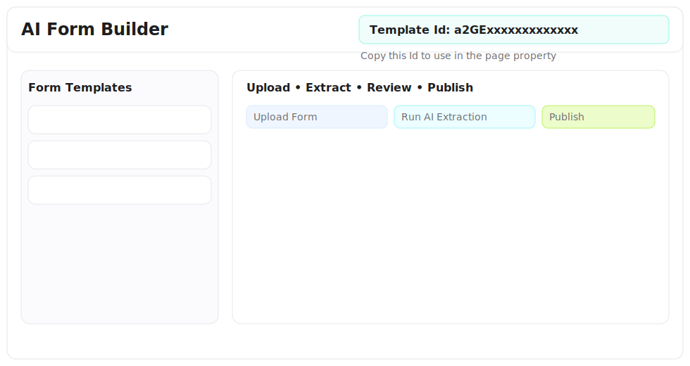
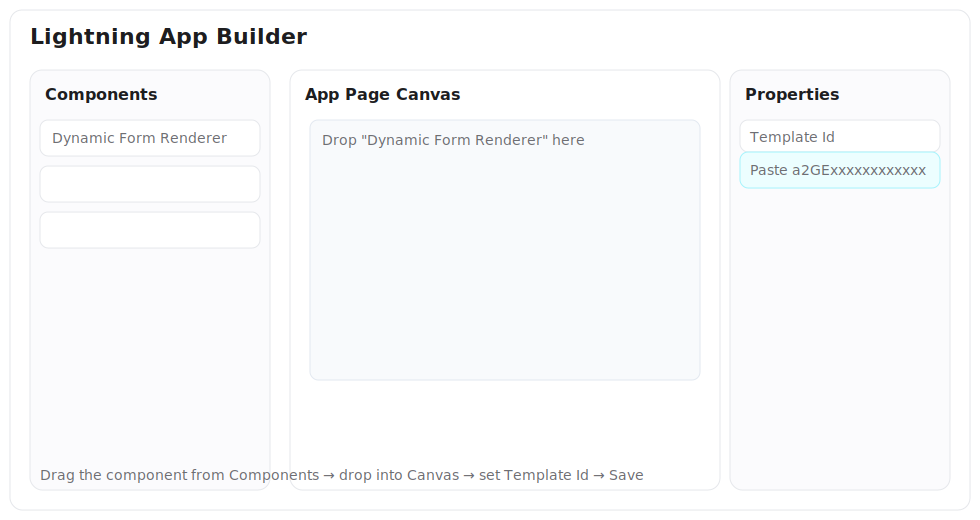
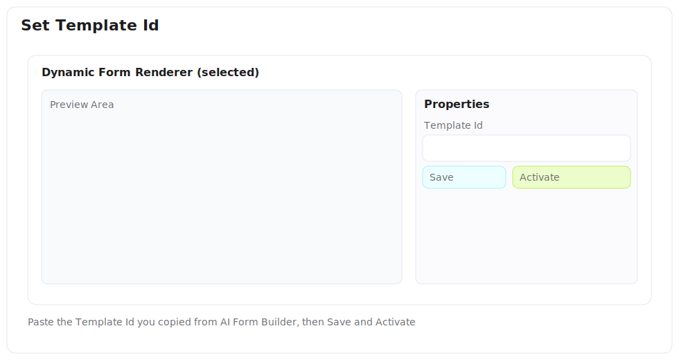

# AI-Powered Form Builder

Make a paper form into a clickable web form in a few minutes.

Think of it like this: you take a picture (or PDF) of a government form, drop it into Salesforce, the AI reads it, finds the blanks and checkboxes, and builds a digital version you can use right away. You do a quick review, fix anything that looks off, and click Publish.

No code. No waiting. Just upload → review → publish.

## How It Works (Simple)

1) Create a Template
- Click “Create Template” and give it a name.

2) Upload the Form
- Upload a photo, scan, or PDF of the paper form. You’ll see a preview.

3) Let AI Do the First Draft
- Click “Run AI Extraction”. The AI finds fields (text, dates, checkboxes, picklists) and suggests their names and positions.

4) Review and Fix
- You get a list of fields. Change labels, types, or “required” if needed. Save.

5) Publish
- Click “Publish Template”. Now it’s ready to use.

6) Use the Form
- Add the "Dynamic Form Renderer" component to a page, set the Template Id, and people can fill it out. Their answers are saved.

## Add The Form To A Page (Lightning App Builder)

You use the `Dynamic Form Renderer` LWC to display a published form. It works on App, Home, and Record pages.

Steps
1) Publish your template
   - In the builder, click `Publish Template`. Status should be `Active`.
2) Copy the Template Id
   - In the builder header, copy the Id shown (begins with `a2` for the custom object).
3) Open Lightning App Builder
   - Setup → App Builder → New or Edit a page (App Page or Home Page works great).
4) Drag the component
   - Find `Dynamic Form Renderer` in the Lightning Components list and drop it onto the canvas.
5) Set the property
   - In the right panel properties, set `Template Id` to the Id from step 2.
6) Save & Activate
   - Save the page and activate it for the desired apps/profiles.

Screenshots

1) Copy Template Id from the AI Form Builder workspace

2) In App Builder, drag Dynamic Form Renderer onto the canvas

3) Set Template Id in the Properties panel, then Save & Activate

Record Page option
- You can also add it to a Record Page (e.g., an object you want to associate with the form). The component does not require a specific record; it only needs `Template Id`. Use this when you want the form available directly from a record’s page layout.

Experience Cloud (optional)
- If you have an Experience site, add the `Dynamic Form Renderer` on an Experience page via Experience Builder. The property panel is the same: paste the `Template Id` and publish the site.

What users see
- The form renders with all fields from your published template.
- Users fill it out and click `Submit`.
- Responses are stored in `Form_Response__c` (one record per submission) with the JSON payload, which you can report on.

Where to find the Template Id fast
- In `AI Form Builder` workspace, select a template; the Id shows at the top of the builder panel.
- In `Form Templates` list, open a template and use the Id from the builder panel.

Troubleshooting
- Nothing renders: ensure the template is `Active` and the `Template Id` in the property panel is correct.
- Missing fields: in the builder, click `Save Reviewed Fields`, then `Publish Template` again. Refresh your page.
- Want multiple forms on one page? Drop multiple `Dynamic Form Renderer` components and set different `Template Id`s.

Optional animated GIF
- Place a short capture at `docs/assets/add-form-to-page.gif` to show the full flow (copy Id → App Builder → paste → save). If present, it will render here:

Bonus: On the builder page, click "Install Sample" to auto‑create a sample template and attach a demo form image.

## Where to Click

- AI Form Builder (App Page Tab):
  - Left side: list of your templates.
  - Right side: the builder (upload, extract, review, publish).
- Dynamic Form Renderer (LWC): use this where people will fill out the form.

## What You Need (One-Time Setup)

- A key for the AI (OpenAI Vision) in Salesforce custom metadata:
  - Go to `LLM_Configuration__mdt` → `OpenAI_GPT4_Vision` and paste your API key. Mark it active.
- Give yourself the permission set: `Form_Builder_Admin`.

That’s it. No Flows. This uses Lightning Web Components (LWC) for the screens and Apex for the logic.

## What Gets Saved

- Templates (`Form_Template__c`): info about the original file + AI’s raw JSON.
- Field Definitions (`Form_Field_Definition__c`): the fields the form will render.
- Logs (`Form_Generation_Log__c`): when AI ran and how it went.
- Responses (`Form_Response__c`): what people typed/selected when they filled the form.

## Tips for Good Results

- Use clear scans or photos (not blurry), 150–600 DPI.
- Keep the whole page in the shot (no cut edges).
- If the AI misses something, just add/fix it in the review table.

## Under the Hood (for Admins/Builders)

- All native: LWC + Apex, no Flows.
- AI call pattern matches `nuviAI` components:
  - Uses `LLM_Configuration__mdt` and `LLM_Prompt_Template__mdt` with `LLMPromptManager`.
  - Remote Site `OpenAI_API` already exists in the repo.
  - Custom prompt: `LLM_Prompt_Template.FormExtraction` (returns strict JSON with fields + layout).
- The renderer is “generic”: it doesn’t create new Salesforce objects/fields at runtime. It reads the field definitions and draws the inputs dynamically, saving answers to `Form_Response__c`.

Extend later if you want full metadata generation via Metadata API (create real custom objects and fields automatically).

## Components in This Folder

- LWC:
  - `aiFormBuilderWorkspace`: split view (template list + builder)
  - `formTemplateList`: shows templates and lets you open one
  - `aiFormBuilderApp`: upload → extract → review → publish
  - `dynamicFormRenderer`: turns definitions into a working form
- Apex:
  - `FormAIService.cls`: runs Vision extraction and maps results
  - `FormBuilderController.cls`: create/update/publish templates
  - `FormResponseController.cls`: get fields + save responses
- Custom Metadata:
  - `LLM_Prompt_Template.FormExtraction`
- Permission Set:
  - `Form_Builder_Admin`
- App Page:
  - `AI_Form_Builder` (Flexipage + Tab)

## Quick Troubleshooting

- "AI call failed": check your API key in `OpenAI_GPT4_Vision` and that it's active.
- No network? The tool falls back to a built‑in mock extraction so you can still review fields and publish.
- "No file found": upload a PDF/image to the template and click "Refresh File".
- "Nothing shows in renderer": make sure you saved reviewed fields and published, and the `templateId` is set on the component.
